```{r, include=FALSE}
library(knitr)
library(kableExtra)
```

## Text mining in an example 

<div style="float: left; width: 20%;">
```{r, echo=FALSE}
include_graphics("img/page2_example.png")
```
</div>

<div style="float: right; width: 80%;">
- **Garry** works at <span style="color:blue">Bol.com</span> (a webshop in the Netherlands)
- He works in the dep of **Customer relationship management**.


- He reads <span style="color:blue">customers’ reviews</span> (comments), extracts <span style="color:blue">aspects</span> they wrote their reviews on, and identifies their <span style="color:blue">sentiments</span>.

- Curious about his job? See two examples!
</div>

## 

<div style="float: left; width: 60%;">
This is a nice book for both young and old. It gives beautiful life lessons in a fun way. Definitely worth the money!

<span style="color:green">+ Educational</span>

<span style="color:green">+ Funny</span>

<span style="color:green">+ Price</span>

<hr align=left width="90%" color=#987cb9 size=3>

Nice story for older children.

<span style="color:green">+ Funny</span>

<span style="color:red">- Readability</span>
</div>

<div style="float: right; width: 40%;">
```{r, echo=FALSE}
include_graphics("img/page3_littleprince.png")
```

## Example
<div style="float: left; with: 20%">
```{r, echo=FALSE}
include_graphics("img/page2_example.png")
```
</div>

<div style="float: right; width: 80%">
- Garry likes his job a lot, but sometimes it is frustrating!

- This is mainly because their company is expanding quickly!

- Garry decides to hire **Larry** as his assistant.

```{r, echo=FALSE, fig.align='right'}

```
</div>

## Example
<div style="float: left; width: 20%">
```{r, echo=FALSE}
include_graphics("img/page2_example.png")
```


```{r, echo=FALSE, out.width = "80%"}

```
</div>

<div style="float: right; width: 80%">
- Still, a lot to do for two people!

- Garry has some budget left to hire another assistant for couple of years!

- He decides to hire **Harry** too!

- Still, manual labeling is labor-intensive!

```{r, echo=FALSE, fig.align='right'}

```
</div>

## Challenges?

- What are the challenges Garry, Larry, and Harry encounter in doing their job, when working with text data?

  - Go to <a href="www.menti.com">www.menti.com</a> and use the code 22 07 62 0

## Challenges with text data

- Huge amount of data

- High dimensional but sparse

  - all possible word and phrase types in the language!!

## Challenges with text data
<div style="float: left; width: 60%">
- Ambiguity
</div>

<div style="float: left; width: 40%">
```{r, echo=FALSE, out.width="70%"}
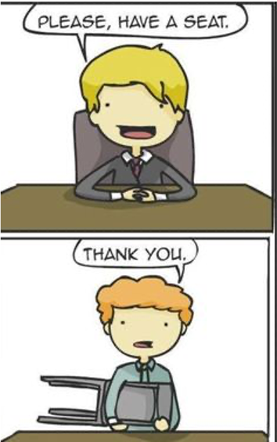
```
</div>

## Challenges with text data
- Noisy data
  
  - Examples: Abbreviations, spelling errors, short text

- Complex relationships between words
  
  - “Hema merges with Intertoys”
  
  - “Intertoys is bought by Hema”

##
Back to the story

## Example {.smaller}
<div style="float: left; width: 20%">
```{r, echo=FALSE}
include_graphics("img/page2_example.png")
```

```{r,echo = FALSE, out.width="90%"}
include_graphics("img/page 11.png")
```
</div>

<div style="float: right; width: 80%">
  - During one of the coffee moments at the company, **Garry** was talking about their situation at the dep of Customer relationship management.

  - When **Carrie**, her colleague from the **IT department**, hears the situation, she offers Garry to use Text Mining!!

  - She says: “Text mining is your friend; it can help you to make the faster by filtering and recommending possible words…”

  - She continues : “<span style="color:blue">Text mining is a subfield of AI and NLP and is related to data science, data mining and machine learning. It will make the process faster and cuts some of the expenses!</span>”

  - After consulting with Larry and Harry, They decide to give text mining a try!
</div>

## Example
```{r, echo=FALSE, out.width="90%", fig.align='center'}
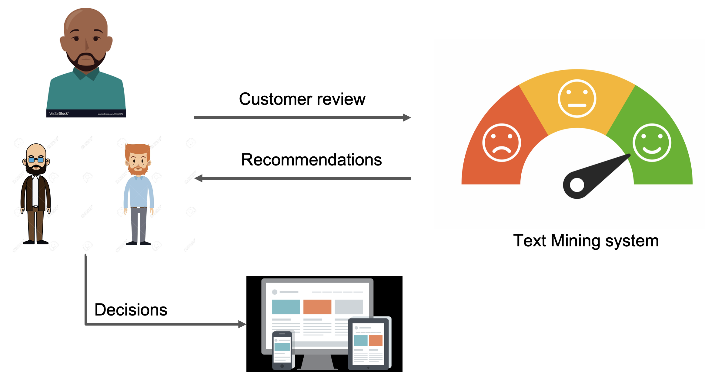
```

## Text mining definition?

- Which can be a part of Text Mining definition?
  - The discovery by computer of new, previously unknown information from textual data
  - Automatically extracting information from text
  - Text mining is about looking for patterns in text
  - Text mining describes a set of techniques that model and structure the information content of textual sources

<br>

<span style="color:green">(You can choose multiple choices)</span>

Go to <a href="www.menti.com">www.menti.com</a> and use the code 22 07 62 0

## Text mining definition
- “the discovery by computer of <span style="color:blue">new</span>, <span style="color:blue">previously unknown</span> information, by <span style="color:blue">automatically extracting</span> information from <span style="color:blue">different</span> written resources” Hearst (1999)

- Text mining is about looking for <span style="color:red">patterns in text</span>, in a similar way that <span style="color:red">data mining</span> can be loosely described as looking for patterns in data.

- Text mining describes a set of <span style="color:green">linguistic</span>, <span style="color:green">statistical</span>, and <span style="color:green">machine learning</span> techniques that model and structure the information content of textual sources. (Wikipedia)

# Logistics

## Access
- You can view my screen on your machine:
  
  - <a href="join.me/r_tm">join.me/r_tm</a>

- Access the course materials from:

  - <a href="http://www.ayoubbagheri.nl/r_tm">http://www.ayoubbagheri.nl/r_tm</a>

## Lecturers and Assistants
<div style="float:left; width:50%">
```{r, echo=FALSE, fig.align='center', out.width="40%"}

```

  <div class="centered">
  **José de Kruif**
  </div>
</div>

<div style="float:right; width:50%">
```{r, echo=FALSE, fig.align='center', out.width="40%"}

```

  <div class="centered">
  **Dong Nguyen**
  </div>
</div>

## Program {.smaller}
```{r, echo = FALSE}
time <- c("9:00 - 10:30", "", "10:45 – 11:45", "11:45 – 12:30", "12:30 – 14:00", "14:00 – 15:30", "", "15:45 – 16:30", "16:30 – 17:00")
monday <- c("Lecture 1", "Break", "Practical 1", "Discussion 1", "Lunch", "Lecture 2", "Break", "Practical 2", "Discussion 2")
tuesday <- c("Lecture 3", "Break", "Practical 3", "Discussion 3", "Lunch", "Lecture 4", "Break", "Practical 4", "Discussion 4")
wednesday <- c("Lecture 5", "Break", "Practical 5", "Discussion 5", "Lunch", "Lecture 6", "Break", "Practical 6", "Discussion 6")

program <- data.frame(Time = time, Monday = monday, Tuesday = tuesday, Wednesday = wednesday)

program %>% 
  kbl() %>% 
  kable_paper("hover", html_font = "Arial", full_width = T) %>% 
  row_spec(c(1,6), bold = T, color = "#E60B60") %>% 
  row_spec(c(2,7), color = "grey", font_size = 12) %>% 
  row_spec(c(3,8), color = "blue") %>% 
  row_spec(c(4,9), color = "green")
```

## Goal of the course
- The course teaches students text mining techniques using R on a variety of applications in many domains of science.

## Do you have any questions?

- **During the lecture**

  - Post your question to the chat; we will read them during a break.

- **During the computer lab**

  - Post your question in general; we will answer them.

- **After the lecture**

  - Feel free to send me an email or text me in Microsoft Teams

# Introduction | Ayoub Bagheri, a.bagheri@uu.nl 
Utrecht Summer School: Applied Text Mining

## Another TM definition

```{r, echo=FALSE, out.width="90%", fig.align='center'}
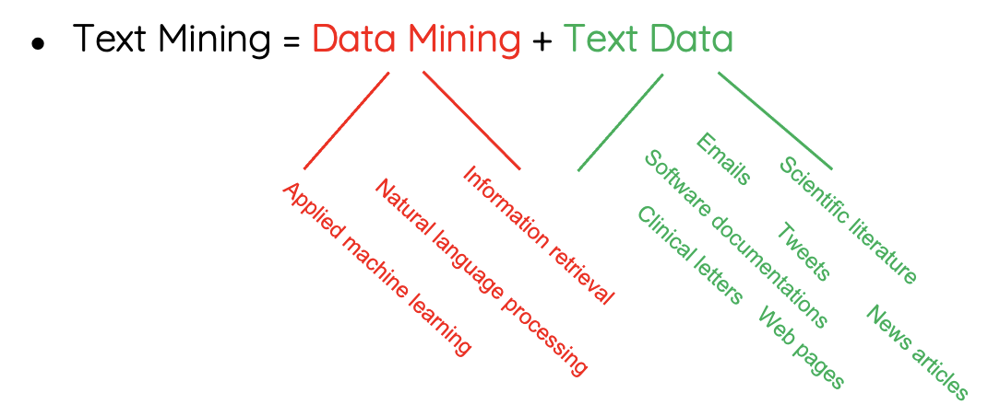
```


## Text mining process
```{r, echo=FALSE, out.width="90%", fig.align='center'}
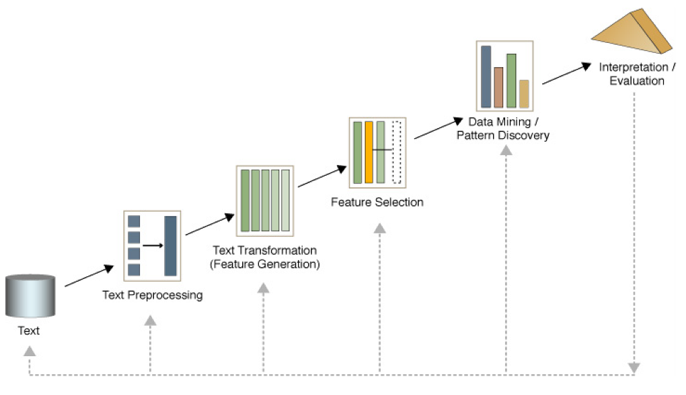
```

##
```{r, echo=FALSE, out.width="80%", fig.align='center'}
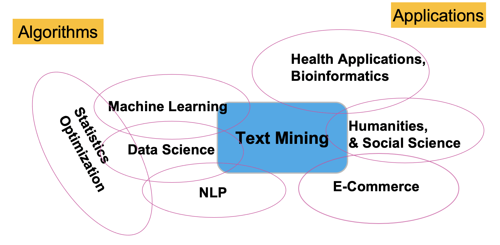
```

##  
```{r, echo=FALSE, out.width="80%", fig.align='center'}
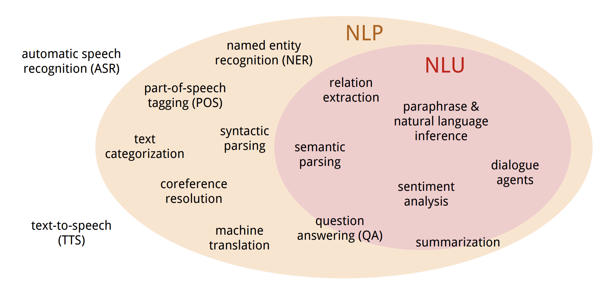
```

<br>
<br>
<div style="font-size:12px">
source: https://nlp.stanford.edu/~wcmac/papers/20140716-UNLU.pdf
</div>

## Text Classification 
```{r, echo=FALSE, out.width="100%", fig.align='center'}

```

## Sentiment/Opinion Analysis
```{r, echo=FALSE, out.width="100%", fig.align='center'}
include_graphics("img/page 27.png")
```

## Statistical machine translation
```{r, echo=FALSE, out.width="100%", fig.align='center'}
include_graphics("img/page 28.png")
```

## Dialog Systems
```{r, echo=FALSE, out.width="100%", fig.align='center'}
include_graphics("img/page 29.png")
```

## Question answering | Go beyond search
```{r, echo=FALSE, out.width="100%", fig.align='center'}
include_graphics("img/page 30.png")
```

## And more ...
- Automatically classify political news from sports news

- Authorship identification

- Age/gender identification

- Language Identification

- Sentiment analysis

- …

##
```{r, echo=FALSE, out.width="90%"}

```

<p style="color:gray; font-size:12px">https://www.nature.com/articles/s41746-021-00404-9</p>

## Disease Classification {data-background="img/page 33_back.png"}
```{r, echo=FALSE, out.width="100%"}
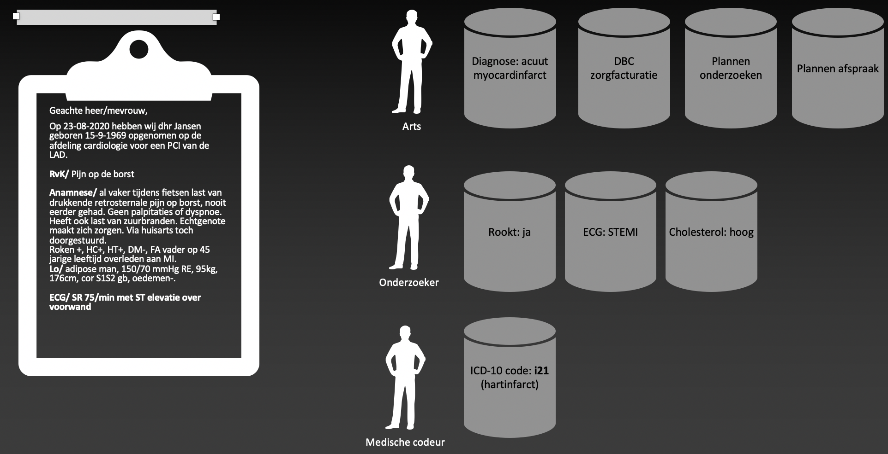
```

##
```{r, echo=FALSE, out.width="100%"}
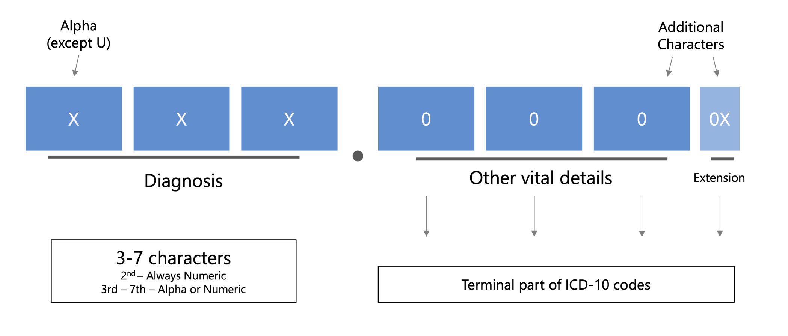
```

##
```{r, echo=FALSE, out.width="100%"}
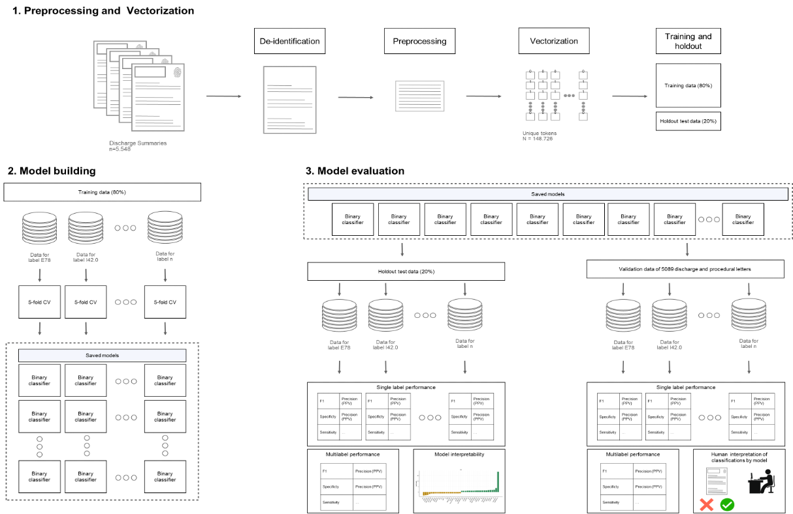
```

##
```{r, echo=FALSE, out.width="100%"}
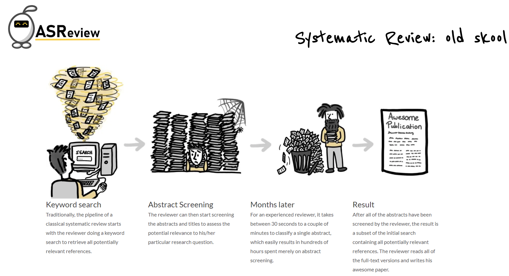
```

##
```{r, echo=FALSE, out.width="100%"}
include_graphics("img/page 37.png")
```

## Contribution to ASReiew
- https://asreview.nl/


- https://github.com/asreview/asreview


- https://github.com/asreview 

## Text mining tasks {.smaller}
- Text classification
- Text clustering

<br>
We will also cover:
  
  - Sentiment analysis
  - Feature selection
  - Topic modelling
  - Word embedding
  - Deep learning models
  - Responsible text mining
  - Text summarization

## Text classification {.smaller}
- Supervised learning
- Human experts annotate a set of text data
  - Training set
- Learn a classification model

```{r, echo=FALSE}
document <- c("Email1", "Email2", "Email3", "...")
class <- c("Not spam", "Not spam", "Spam", "...")
data.frame(Document = document, Class = class) %>% 
  kbl() %>% 
  kable_styling(fixed_thead = T, position ="float_left") %>% 
  kable_paper("hover", full_width=F, ) %>% 
  row_spec(1:4, color = "green") %>% 
  column_spec(1:2, width = "5cm")
```


## Text classification? {.smaller}
- Which problem is not a text classification task? (less likely to be)
  
  - Author's gender detection from text
  
  - Finding about the smoking conditions of patients from clinical letters
  
  - Grouping news articles into political vs non-political news
  
  - Classifying reviews into positive and negative sentiment

<br>
Go to <a href="www.menti.com">www.menti.com</a> and use the code 86 08 86 5

## Text clustering
- Unsupervised learning
- Finding Groups of Similar Documents
- No labeled data

```{r, echo=FALSE}
document <- c("News article1", "News article2", "News article3", "...")
cluster <- c("?", "?", "?", "...")
data.frame(Document = document, Cluster = cluster) %>% 
  kbl() %>% 
  kable_styling(fixed_thead = T, position ="float_left") %>% 
  kable_paper("hover", full_width=F) %>% 
  row_spec(1:4, color = "green") %>% 
  column_spec(1:2, width = "5cm")
```

## Text Clustering?
- Which problem is not a text clustering task? (less likely to be)
  
  - Grouping similar news articles
  
  - Grouping discharge letters in two categories: heart disease vs cancer
  
  - Grouping tweets which support Trump into three undefined subgroups
  
  - Grouping online books of a library in 10 categories

<br>
Go to <a href="www.menti.com">www.menti.com</a> and use the code 86 08 86 5

# Regular expressions

## Regular Expressions
<br>
<br>
<div style="margin: auto 3em; text-align: justify; width: 80%">
<font size="+2">In <a href="https://en.wikipedia.org/wiki/Computing">computing</a>, a regular expression, also referred to as "regex" or "regexp", provides a concise and flexible means for matching strings of <a href="https://en.wikipedia.org/wiki/String_(computer_science)">text</a>, such as particular characters, words, or patterns of characters. A regular expression is written in a formal language <a href="https://en.wikipedia.org/wiki/Formal_language#Programming_languages">that can be interpreted</a> by a regular expression processor.</font>

<br>
<br>
<br>
<br>
<font size="-1">http://en.wikipedia.org/wiki/Regular_expression</font>
</div>

## Regular Expressions

<br>
<br>
<div style="margin: auto 3em; text-align: justify; width: 80%">
<font size="+2">**Really clever "wild card" expressions for matching and parsing strings.**</font>

<br>
<br>
<br>
<br>
<br>
<br>
<br>
<br>
<font size="-1">http://en.wikipedia.org/wiki/Regular_expression</font>
</div>

## Understanding Regular Expressions
  - Very powerful and quite cryptic

  - Fun once you understand them
  
  - Regular expressions are a language unto themselves

  - A language of "marker characters" - programming with characters
  
  - It is kind of an "old school" language - compact

## Regular expressions
- A formal language for specifying text strings
- How can we search for any of these?
  
  - woodchuck
  
  - woodchucks
  
  - Woodchuck
  
  - Woodchucks

## Regular Expressions: Disjunctions
- Letters inside square brackets []
```{r, echo=FALSE, out.width="80%"}
include_graphics("img/page 49_1.png")
```


- Ranges <span style="color:red">[A-Z]</span>
```{r, echo=FALSE, out.width="100%"}
include_graphics("img/page 49.png")
```

## Regular Expressions: Negation in Disjunction
- Negations <span style="color:red">[^Ss]</span>

  - Carat means negation only when first in []

```{r, echo=FALSE, out.width="100%"}
include_graphics("img/page 50.png")
```

## Regular Expressions: More Disjunction

- Woodchucks is another name for groundhog!
- The pipe | for disjunction

```{r, echo=FALSE, out.width="80%"}
include_graphics("img/page 51.png")
```

## Regular Expressions: <span style="color:red">?    *  +  .</span>

```{r, echo=FALSE, out.width="80%", fig.align="center"}
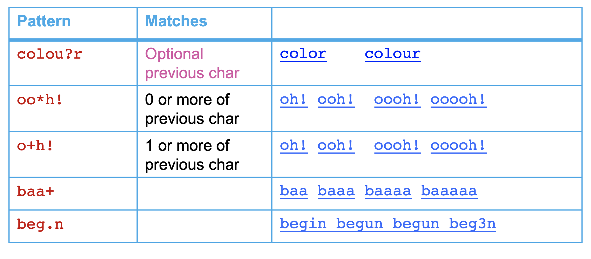
```

## Regular Expressions: Anchors  <span style="color:red">^   $</span>
```{r, echo=FALSE, out.width="80%", fig.align="center"}
include_graphics("img/page 53.png")
```

## Example 

- Find me all instances of the word “the” in a text.

<span style="color:purple">the</span>
<br>
<br>
<p style="text-align:center;">Misses capitalized examples</p>
<br>
<br>
<span style="color:green">[tT]he</span>
<br>
<br>
<p style="text-align:center;">Incorrectly returns other or theology</p>
<br>
<br>
<span style="color:blue">[^a-zA-Z]</span><span style="color:red">[tT]</span>he<span style="color:blue">[^a-zA-Z]</span>

## Errors

- The process we just went through was based on <span style="color:darkred">fixing two kinds of errors</span>

  - Matching strings that we should not have matched (<span style="color:darkred">the</span>re, <span style="color:darkred">the</span>n, o<span style="color:darkred">the</span>r)
  
    - <span style="color:darkred">False positives (Type I)</span>
  
  - Not matching things that we should have matched (The)
  
    - <span style="color:darkred">False negatives (Type II)</span>

## Errors cont.

- In NLP we are always dealing with these kinds of errors.

- Reducing the error rate for an application often involves two antagonistic efforts: 

  - <span style="color:darkgreen">Increasing accuracy or precision</span> (minimizing false positives)

  - <span style="color:darkgreen">Increasing coverage or recall</span> (minimizing false negatives).

##
```{r, echo=FALSE, out.width="100%"}
include_graphics("img/page 57.png")
```

## Regular Expression Quick Guide

<center>
<table style="width:100%;margin-left:auto;margin-right:auto">
  <tr>
    <td><span style="font-size:18px">^</span></td>
    <td><span style="font-size:18px">Matches the beginning of a line</span></td>
  </tr>
  <tr>
    <td><span style="font-size:18px">$</span></td>
    <td><span style="font-size:18px">Matches the end of the line</span></td>
  </tr>
  <tr>
    <td><span style="font-size:18px">.</span></td>
    <td><span style="font-size:18px">Matches any character</span></td>
  </tr>
  <tr>
    <td><span style="font-size:18px">&Backslash;s</span></td>
    <td><span style="font-size:18px">Matches whitespace</span></td>
  </tr>
  <tr>
    <td><span style="font-size:18px">&Backslash;S</span></td>
    <td><span style="font-size:18px">Matches any non-whitespace character</span></td>
  </tr>
  <tr>
    <td><span style="font-size:18px">*</span></td>
    <td><span style="font-size:18px">Repeats a character zero or more times</span></td>
  </tr>
  <tr>
    <td><span style="font-size:18px">*?</span></td>
    <td><span style="font-size:18px">Repeats a character zero or more times (non-greedy)</span></td>
  </tr>  
  <tr>
    <td><span style="font-size:18px">+</span></td>
    <td><span style="font-size:18px">Repeats a chracter one or more times</span></td>
  </tr>    
  <tr>
    <td><span style="font-size:18px">+?</span></td>
    <td><span style="font-size:18px">Repeats a character one or more times (non-greedy)</span></td>
  </tr>    
  <tr>
    <td><span style="font-size:18px">[aeiou]</span></td>
    <td><span style="font-size:18px">Matches a single character in the listed set</span></td>
  </tr>   
  <tr>
    <td><span style="font-size:18px">[^XYZ]</span></td>
    <td><span style="font-size:18px">Matches a single character not in the listed set</span></td>
  </tr>  
  <tr>
    <td><span style="font-size:18px">[a-z0-9]</span></td>
    <td><span style="font-size:18px">The set of characters can include a range</span></td>
  </tr>  
  <tr>
    <td><span style="font-size:18px">(</span></td>
    <td><span style="font-size:18px">Indicates where string extraction is to start</span></td>
  </tr>  
  <tr>
    <td><span style="font-size:18px">)</span></td>
    <td><span style="font-size:18px">Indicates where string extraction is to end</span></td>
  </tr> 
</table>
</center>


## In R: Medical example

# Summary

## Summary: what did we learn?
- Regular expressions play a surprisingly large role

  - Sophisticated sequences of regular expressions are often the first model for any text processing text

- For many hard tasks, we use machine learning classifiers

  - But regular expressions are used as features in the classifiers

  - Can be very useful in capturing generalizations

- Regular expressions are a cryptic but powerful language for matching strings and extracting elements from those strings

- Regular expressions have special characters that indicate intent

# Practical 1
