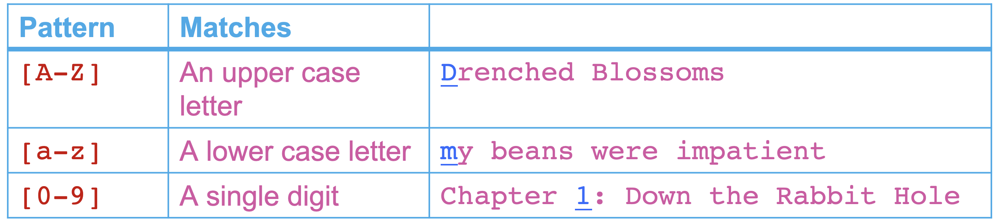

```{r, include=FALSE}
library(knitr)
library(kableExtra)
```

## 
<div style="float: left; width:100%">
```{r, echo=FALSE, fig.align='center', out.width="100%"}
include_graphics("img/ex1.jpg")
```
</div>


## 
<div style="float: left; width:100%">
```{r, echo=FALSE, fig.align='center', out.width="100%"}
include_graphics("img/ex2.jpg")
```
</div>


##
<div style="float: left; width:100%">
```{r, echo=FALSE, fig.align='center', out.width="100%"}
include_graphics("img/ex3.jpg")
```
</div>

# Course Logistics

## Course materials

You can access the course materials quickly from

https://ayoubbagheri.nl/r_tm/

<!-- Some guidelines -->

<!-- 1- Please keep your microphone off -->

<!-- 2- If you have a question, raise your hand or type your question in the chat -->

<!-- 3- You may always interrupt me -->

<!-- 4- We will introduce frequent question breaks -->

## Teachers

<div style="float:left; width:50%">
```{r, echo=FALSE, fig.align='center', out.width="30%"}
include_graphics("img/Qixiang_Fang.png")
```
  <div class="centered">
  **Qixiang**
  </div>
  
  <br/>
```{r, echo=FALSE, fig.align='center', out.width="30%"}
include_graphics("img/Mees van Stiphout.jpg")
```
  <div class="centered">
  **Mees**
  </div>
</div>


<div style="float:right; width:50%">
```{r, echo=FALSE, fig.align='center', out.width="30%"}

```
  <div class="centered">
  **Daniel**
  </div>
  <br/>
```{r, echo=FALSE, fig.align='center', out.width="30%"}

```
  <div class="centered">
  **Pablo**
  </div>
</div>


## Program {.smaller}
```{r, echo = FALSE}
time <- c("9:00 - 10:30", "", "10:45 – 11:45", "11:45 – 12:30", "", "13:45 – 15:15", "", "15:30 – 16:30", "16:30 – 17:00")
monday <- c("Lecture 1", "Break", "Practical 1", "Discussion 1", "Lunch", "Lecture 2", "Break", "Practical 2", "Discussion 2")
tuesday <- c("Lecture 3", "Break", "Practical 3", "Discussion 3", "Lunch", "Lecture 4", "Break", "Practical 4", "Discussion 4")
wednesday <- c("Lecture 5", "Break", "Practical 5", "Discussion 5", "Lunch", "Lecture 6", "Break", "Practical 6", "Discussion 6")
thursday <- c("Lecture 7", "Break", "Practical 7", "Discussion 7", "Lunch", "Lecture 8", "Break", "Practical 8", "Discussion 8")

program <- data.frame(Time = time, Monday = monday, Tuesday = tuesday, Wednesday = wednesday, Thursday = thursday)

program %>% 
  kbl() %>% 
  kable_paper("hover", html_font = "Arial", full_width = T) %>% 
  row_spec(c(1,6), bold = T, color = "#E60B60") %>% 
  row_spec(c(2,7), color = "grey", font_size = 12) %>% 
  row_spec(c(3,8), color = "blue") %>% 
  row_spec(c(4,9), color = "green")
```

## Goal of the course
- Text data is everywhere!
- A lot of world’s data is in unstructured text format
- The course teaches 
  - text mining techniques 
  - using R 
  - on a variety of applications 
  - in many domains.

# What is Text Mining?

## Text mining in an example 

<div style="float: left; width: 20%;">
```{r, echo=FALSE}
include_graphics("img/page2_example.png")
```
</div>

<div style="float: right; width: 80%;">
- This is **Garry**!
- **Garry** works at <span style="color:blue">Bol.com</span> (a webshop in the Netherlands)
- He works in the dep of **Customer relationship management**.


- He uses Excel to read and search <span style="color:blue">customers’ reviews</span>, extract <span style="color:blue">aspects</span> they wrote their reviews on, and identify their <span style="color:blue">sentiments</span>.

- Curious about his job? See two examples!
</div>

## 

<div style="float: left; width: 60%;">
This is a nice book for both young and old. It gives beautiful life lessons in a fun way. Definitely worth the money!

<span style="color:green">+ Educational</span>

<span style="color:green">+ Funny</span>

<span style="color:green">+ Price</span>

<hr align=left width="90%" color=#987cb9 size=3>

Nice story for older children.

<span style="color:green">+ Funny</span>

<span style="color:red">- Readability</span>
</div>

<div style="float: right; width: 40%;">
```{r, echo=FALSE}
include_graphics("img/page3_littleprince.png")
```

## Example
<div style="float: left; with: 20%">
```{r, echo=FALSE}
include_graphics("img/page2_example.png")
```
</div>

<div style="float: right; width: 80%">
- Garry likes his job a lot, but sometimes it is frustrating!

- This is mainly because their company is expanding quickly!

- Garry decides to hire **Larry** as his assistant.

```{r, echo=FALSE, fig.align='right'}
include_graphics("img/page4_person2.png")
```
</div>

## Example
<div style="float: left; width: 20%">
```{r, echo=FALSE}
include_graphics("img/page2_example.png")
```


```{r, echo=FALSE, out.width = "80%"}
include_graphics("img/page4_person2.png")
```
</div>

<div style="float: right; width: 80%">
- Still, a lot to do for two people!

- Garry has some budget left to hire another assistant for couple of years!

- He decides to hire **Harry** too!

- Still, manual labeling using Excel is labor-intensive!

```{r, echo=FALSE, fig.align='right'}
include_graphics("img/page5_person3.png")
```
</div>

## Challenges?

- What are the challenges they encounter in working with text?

<div style="float: left; width:90%">
```{r, echo=FALSE, fig.align='center', out.width="90%"}

```
</div>

<!-- # Challenges with Text Data -->

<!-- ## Challenges with text data -->

<!-- - Huge amount of data -->

<!-- - High dimensional but sparse -->

<!--   - all possible word and phrase types in the language!! -->

<!-- ## Challenges with text data -->
<!-- <div style="float: left; width: 60%"> -->
<!-- - Ambiguity -->
<!-- </div> -->

<!-- <div style="float: left; width: 40%"> -->
<!-- ```{r, echo=FALSE, out.width="70%"} -->
<!--  -->
<!-- ``` -->
<!-- </div> -->

<!-- ## Challenges with text data -->
<!-- - Noisy data -->

<!--   - Examples: Abbreviations, spelling errors, short text -->

<!-- - Complex relationships between words -->

<!--   - “Hema merges with Intertoys” -->

<!--   - “Intertoys is bought by Hema” -->


## Language is hard!

- Different things can mean more or less the same ("data science" vs. "statistics")
- Context dependency ("You have very nice shoes");
- Same words with different meanings ("to sanction", "bank");
- Lexical ambiguity ("we saw her duck")
- Irony, sarcasm ("That's just what I needed today!", "Great!", "Well, what a surprise.")
- Figurative language ("He has a heart of stone")
- Negation ("not good" vs. "good"), spelling variations, jargon, abbreviations
- All the above are different over languages, 99\% of work is on English!


<!-- ## Text mining definition? -->

<!-- - Which can be a part of Text Mining definition? -->
<!--   - The discovery by computer of new, previously unknown information from textual data -->
<!--   - Automatically extracting information from text -->
<!--   - Text mining is about looking for patterns in text -->
<!--   - Text mining describes a set of techniques that model and structure the information content of textual sources -->

<!-- <br> -->

<!-- <span style="color:green">(You can choose multiple answers)</span> -->

<!-- Go to [www.menti.com](https://www.menti.com/) and use the code 9594 3321 -->

## Text mining
- “the discovery by computer of <span style="color:blue">new</span>, <span style="color:blue">previously unknown</span> information, by <span style="color:blue">automatically extracting</span> information from <span style="color:blue">different</span> written resources” Hearst (1999)

- Text mining is about looking for <span style="color:red">patterns in text</span>, in a similar way that <span style="color:red">data mining</span> can be loosely described as looking for patterns in data.

- Text mining describes a set of <span style="color:green">linguistic</span>, <span style="color:green">statistical</span>, and <span style="color:green">machine learning</span> techniques that model and structure the information content of textual sources. (Wikipedia)

<!-- ## Another TM definition -->

<!-- ```{r, echo=FALSE, out.width="90%", fig.align='center'} -->
<!--  -->
<!-- ``` -->


## Language is hard!

- We won't solve linguistics ...
- In spite of the problems, text mining can be quite effective!

# Examples & Applications

## Text mining applications
```{r, echo=FALSE, out.width="90%", fig.align='center'}

```

## Who wrote the Wilhelmus?


https://dh2017.adho.org/abstracts/079/079.pdf

## Text Classification
```{r, echo=FALSE, out.width="100%", fig.align='center'}
include_graphics("img/page 26.png")
```

<!-- ## Which ICD-10 codes should I give this doctor's note? -->
<!-- <div style="font-size:4pt; border:1px solid;"> -->

<!-- Bovengenoemde patiënt was opgenomen op <DATUM-1> op de <PERSOON-1> voor het specialisme **Cardiologie.**  -->

<!-- **Cardiovasculaire risicofactoren**: Roken(-) Diabetes(-) Hypertensie(?) Hypercholesterolemie (?) -->

<!-- **Anamnese**. Om 18.30 pijn op de borst met uitstraling naar de linkerarm, zweten, misselijk. Ambulance gebeld en bij aansluiten monitor beeld van acuut onderwandinfarct. -->
<!-- AMBU overdracht:.500mg aspegic iv, ticagrelor 180mg oraal, heparine, zofran eenmalig, 3x NTG spray. HD stabiel gebleven. . .Medicatie bij presentatie.Geen.. -->

<!-- **Lichamelijk onderzoek**. Grauw, vegetatief, Halsvenen niet gestuwd. Cor s1 s2 geen souffles.Pulm schoon. Extr warm en slank . -->

<!-- **Aanvullend onderzoek**. AMBU ECG: Sinusritme, STEMI inferior III)II C/vermoedelijk RCA. -->
<!-- Coronair angiografie. (...) .Conclusie angio: 1-vatslijden..PCI  -->

<!-- **Conclusie en beleid** -->
<!-- Bovengenoemde <LEEFTIJD-1> jarige man, blanco cardiale voorgeschiedenis, werd gepresenteerd vanwege een  STEMI inferior waarvoor een spoed PCI werd verricht van de mid-RCA. Er bestaan geen relevante nevenletsels. Hij kon na de procedure worden overgeplaatst naar de CCU van het <INSTELLING-2>. ..Dank voor de snelle overname. ..Medicatie bij overplaatsing. Acetylsalicylzuur dispertablet 80mg ; oraal; 1 x per dag 80 milligram ; <DATUM-1> .Ticagrelor tablet 90mg ; oraal; 2 x per dag 90 milligram ; <DATUM-1> .Metoprolol tablet   50mg ; oraal; 2 x per dag 25 milligram ; <DATUM-1> .Atorvastatine tablet 40mg (als ca-zout-3-water) ; oraal; 1 x per dag 40 milligram ; <DATUM-1>  -->
<!-- **Samenvatting** -->
<!-- Hoofddiagnose: STEMI inferior wv PCI RCA. Geen nevenletsels. Nevendiagnoses: geen. -->
<!-- Complicaties: geen Ontslag naar: CCU <INSTELLING-2>. -->
<!-- </div> -->

## Which ICD-10 codes should I give this doctor's note?


## Sentiment Analysis / Opinion Mining
```{r, echo=FALSE, out.width="100%", fig.align='center'}
include_graphics("img/page 27.png")
```

## Statistical Machine Translation
```{r, echo=FALSE, out.width="100%", fig.align='center'}
include_graphics("img/page 28.png")
```

## Dialog Systems
```{r, echo=FALSE, out.width="100%", fig.align='center'}

```

## Question Answering | Go beyond search
```{r, echo=FALSE, out.width="100%", fig.align='center'}
include_graphics("img/page 30.png")
```


## Which studies go in my systematic review?


##
```{r, echo=FALSE, out.width="100%"}
include_graphics("img/page 37.png")

```
https://asreview.nl/

## And more ...
- Automatically classify political news from sports news

- Authorship identification

- Age/gender identification

- Language Identification

- …

# Process & Tasks

## Text mining process
```{r, echo=FALSE, out.width="90%", fig.align='center'}
include_graphics("img/page 23.png")
```

## Text mining tasks {.smaller}
- Text classification
- Text clustering
- Sentiment analysis
- Feature selection
- Topic modelling
- Word embedding
- Deep learning models
- Responsible text mining
- Text summarization

## And more in NLP
```{r, echo=FALSE, out.width="80%", fig.align='center'}

```

<br>
<br>
<div style="font-size:12px">
source: https://nlp.stanford.edu/~wcmac/papers/20140716-UNLU.pdf
</div>

<!-- ## Text classification {.smaller} -->
<!-- - Supervised learning -->
<!-- - Human experts annotate a set of text data -->
<!--   - Training set -->
<!-- - Learn a classification model -->

```{r, echo=FALSE}
#document <- c("Email1", "Email2", "Email3", "...")
#class <- c("Not spam", "Not spam", "Spam", "...")
#data.frame(Document = document, Class = class) %>% 
#  kbl() %>% 
#  kable_styling(fixed_thead = T, position ="float_left") %>% 
#  kable_paper("hover", full_width=F, ) %>% 
#  row_spec(1:4, color = "green") %>% 
#  column_spec(1:2, width = "5cm")
```


<!-- ## Text classification? {.smaller} -->
<!-- - Which problem is not a text classification task? (less likely to be) -->

<!--   - Author's gender detection from text -->

<!--   - Finding about the smoking conditions of patients from clinical letters -->

<!--   - Grouping news articles into political vs non-political news -->

<!--   - Classifying reviews into positive and negative sentiment -->

<!-- <br> -->
<!-- Go to <a href="www.menti.com">www.menti.com</a> and use the code 86 08 86 5 -->

<!-- ## Text clustering -->
<!-- - Unsupervised learning -->
<!-- - Finding Groups of Similar Documents -->
<!-- - No labeled data -->

```{r, echo=FALSE}
#document <- c("News article1", "News article2", "News article3", "...")
#cluster <- c("?", "?", "?", "...")
#data.frame(Document = document, Cluster = cluster) %>% 
# kbl() %>% 
#  kable_styling(fixed_thead = T, position ="float_left") %>% 
#  kable_paper("hover", full_width=F) %>% 
#  row_spec(1:4, color = "green") %>% 
#  column_spec(1:2, width = "5cm")
```

<!-- ## Text Clustering? -->
<!-- - Which problem is not a text clustering task? (less likely to be) -->

<!--   - Grouping similar news articles -->

<!--   - Grouping discharge letters in two categories: heart disease vs cancer -->

<!--   - Grouping tweets which support Trump into three undefined subgroups -->

<!--   - Grouping online books of a library in 10 categories -->

<!-- <br> -->
<!-- Go to <a href="www.menti.com">www.menti.com</a> and use the code 86 08 86 5 -->

## 10-minute break

<div align="center">
<br>

</div>

# Regular Expressions

## Regular expressions

<br>
<br>
<div style="margin: auto 3em; text-align: justify; width: 80%">
<font size="+2">**Really clever "wild card" expressions for matching and parsing strings.**</font>

<br>
<br>
<br>
<br>
<br>
<br>
<br>
<br>
<font size="-1">http://en.wikipedia.org/wiki/Regular_expression</font>
</div>

## Regular expressions
<br>
<br>
<div style="margin: auto 3em; text-align: justify; width: 80%">
<font size="+2">In <span style="text-decoration:underline">computing</span>, a regular expression, also referred to as "regex" or "regexp", provides a concise and flexible means for matching strings of <span style="text-decoration:underline">text</span>, such as particular characters, words, or patterns of characters. A regular expression is written in a formal language <span style="text-decoration:underline">that can be interpreted</span> by a regular expression processor.</font>

<br>
<br>
<br>
<br>
<font size="-1">http://en.wikipedia.org/wiki/Regular_expression</font>
</div>


## In R

The primary R functions for dealing with regular expressions are:

- `grep()`, `grepl()`: Search for matches of a regular expression/pattern in a character vector

- `regexpr()`, `gregexpr()`: Search a character vector for regular expression matches and return the indices where the match begins; useful in conjunction with `regmatches()`

- `sub()`, `gsub()`: Search a character vector for regular expression matches and replace that match with another string

- The `stringr` package provides a series of functions implementing much of the regular expression functionality in R but with a more consistent and rationalized interface.


## Understanding Regular Expressions
  - Very powerful and quite cryptic

  - Fun once you understand them
  
  - Regular expressions are a programming language with characters
  
  - It is kind of an "old school" language

## Regular expressions
- A formal language for specifying text strings
- How can we search for any of these?
  
  - netherland
  
  - netherlands
  
  - Netherland
  
  - Netherlands

## Some simple regex searches
```{r, echo=FALSE, out.width="100%"}
include_graphics("img/RE1.png")
```

## Disjunction
The use of the brackets [] to specify a disjunction of characters:

```{r, echo=FALSE, out.width="100%"}
include_graphics("img/RE2.png")
```

The pipe sympol **|** is also for disjunction:

```{r, echo=FALSE, out.width="80%"}
include_graphics("img/RE12.png")
```


## Brackets and dash
The use of the brackets [] plus the dash - to specify a range:

```{r, echo=FALSE, out.width="100%"}
include_graphics("img/RE3.png")
```


## Negation
The caret ^ for negation or just to mean ^:

```{r, echo=FALSE, out.width="100%"}
include_graphics("img/RE4.png")
```

## Question and period marks
The question mark ? marks optionality of the previous expression:

```{r, echo=FALSE, out.width="100%"}
include_graphics("img/RE5.png")

```


The use of the period . to specify any character:

```{r, echo=FALSE, out.width="100%"}
include_graphics("img/RE6.png")

```

<!-- ## Regular Expressions: <span style="color:red">?    *  +  .</span> -->

<!-- ```{r, echo=FALSE, out.width="80%", fig.align="center"} -->
<!-- include_graphics("img/page 52.png") -->
<!-- ``` -->

## Anchors

```{r, echo=FALSE, out.width="100%"}
include_graphics("img/RE7.png")
```

## Common sets

Aliases for common sets of characters:

```{r, echo=FALSE, out.width="100%"}
include_graphics("img/RE9.png")
```

The backslash for escaping!

## Operators for counting

```{r, echo=FALSE, out.width="100%"}
include_graphics("img/RE10.png")
```

- Patterns are **greedy**: In these cases regular expressions always match the largest string they can, expanding to cover as much of a string as they can.

- Enforce non-greedy matching, using another meaning of the ? qualifier. 

  - The operator *? is a Kleene star that matches as little text as possible. 
  - The operator +? is a Kleene plus that matches as little text as possible.

## Other

Some characters that need to be backslashed:

```{r, echo=FALSE, out.width="100%"}
include_graphics("img/RE11.png")
```

## Operator precedence hierarchy

```{r, echo=FALSE, out.width="100%"}
include_graphics("img/RE8.png")
```

<!-- ## Regular Expressions: Disjunctions -->
<!-- - Letters inside square brackets [] -->
<!-- ```{r, echo=FALSE, out.width="80%"} -->
<!-- include_graphics("img/page 49_1.png") -->
<!-- ``` -->


<!-- - Ranges <span style="color:red">[A-Z]</span> -->
<!-- ```{r, echo=FALSE, out.width="100%"} -->
<!--  -->
<!-- ``` -->

<!-- ## Regular Expressions: Negation in Disjunction -->
<!-- - Negations <span style="color:red">[^Ss]</span> -->

<!--   - Carat means negation only when first in [] -->

<!-- ```{r, echo=FALSE, out.width="100%"} -->
<!--  -->
<!-- ``` -->

<!-- ## Regular Expressions: More Disjunction -->

<!-- - Woodchucks is another name for groundhog! -->
<!-- - The pipe | for disjunction -->

<!-- ```{r, echo=FALSE, out.width="80%"} -->
<!-- include_graphics("img/page 51.png") -->
<!-- ``` -->


<!-- ## Regular Expressions: Anchors  <span style="color:red">^   $</span> -->
<!-- ```{r, echo=FALSE, out.width="80%", fig.align="center"} -->
<!--  -->
<!-- ``` -->

## Example

- Find all instances of the word “the” in a text.

<span style="color:purple">the</span>
<br>
<br>
<p style="text-align:center;">Misses capitalized examples</p>
<br>
<br>
<span style="color:green">[tT]he</span>
<br>
<br>
<p style="text-align:center;">Incorrectly returns words such as <span style="color:red">other</span> or <span style="color:red">Netherlands</span></p>
<br>
<br>
<span style="color:blue">[^a-zA-Z]</span><span style="color:red">[tT]</span>he<span style="color:blue">[^a-zA-Z]</span>

Still not compeletly correct! What is missing? 
<!-- (^|[^a-zA-Z])[tT]he($|[^a-zA-Z]) -->

## Example
```{r}
txt <- "The other the Netherlands will then be without the"
r   <- gregexpr("[^a-zA-Z][tT]he[^a-zA-Z]", txt)
print(regmatches(txt, r))

r   <- gregexpr("(^|[^a-zA-Z])[tT]he($|[^a-zA-Z])", txt)
print(regmatches(txt, r))

```


## Errors

- The process we just went through was based on <span style="color:darkred">fixing two kinds of errors</span>

  - Matching strings that we should not have matched (**the**re, Ne**the**rlands)
  
    - <span style="color:darkred">False positives (Type I)</span>
  
  - Not matching things that we should have matched (The)
  
    - <span style="color:darkred">False negatives (Type II)</span>

## Errors cont.

- In NLP we are always dealing with these kinds of errors.

- Reducing the error rate for an application often involves: 

  - <span style="color:darkgreen">Increasing precision</span> (minimizing false positives)

  - <span style="color:darkgreen">Increasing recall</span> (minimizing false negatives).
  
## Question

Given the text "this Summer   School is utrecht summerschool", which RE finds all the summer school mentions?

- (^|[^a-zA-Z])[sS]ummer *[sS]chool($|[^a-zA-Z])
- (^|[^a-zA-Z])[sS]ummer\\s[sS]chool($|[^a-zA-Z])
- (^|[^a-zA-Z])[sS]ummer *[sS]chool($|[^a-zA-Z])
- [^a-zA-Z][sS]ummer\\s[sS]chool($|[^a-zA-Z])

Go to [www.menti.com](https://www.menti.com/) and use the code 9594 3321


## Solution

```{r}
txt <- "this Summer   School is utrecht summerschool"
r <- gregexpr("(^|[^a-zA-Z])[sS]ummer *[sS]chool($|[^a-zA-Z])", txt)
#r <- gregexpr("(^|[^a-zA-Z])[sS]ummer\\s*[sS]chool($|[^a-zA-Z])", txt)

print(regmatches(txt, r))

```

 <!-- four \ for backslash: \\\\ -->


## Question

Suppose we want to build an application to help a user buy a car from pdf (text) catalogues. The user looks for any car cheaper than $10,000.00. Which RE will help us to do this?

Assume we are using the following data:
txt <- c("Price of Tesla S is $8599.99.", 
         "Audi Q4 is $7000.", 
         "BMW X5 costs $900") 

- (ˆ|\\W)\\$[0-9]{0,4}(\\.[0-9][0-9])*
- (ˆ|\\W)\\$[0-9]{0,3}(\\.[0-9][0-9])+
- (ˆ|\\W)\\$[0-9]{0,4}(\\.[0-9][0-9])?
- (ˆ|\\W)\\$[0-9][0-9][0-9][0-9](\\.[0-9][0-9])*

<!-- Go to [www.menti.com](https://www.menti.com/) and use the code 9594 3321 -->


## Solution

```{r}
txt <- c("Price of Tesla S is $8599.99.", 
         "Audi Q4 is $7000.", 
         "BMW X5 costs $900") 
r <- gregexpr("(ˆ|\\W)\\$[0-9]{0,4}(\\.[0-9][0-9])?", txt)
print(regmatches(txt, r))

```

<!-- ## Regular Expression Quick Guide -->

<!-- ```{r, echo=FALSE} -->
<!-- # sign <- c("^", "$", ".", "\\s", "\\S", "*", "*?", "+", "+?", "[aeiou]", "[^XYZ]", "[a-z0-9]", "(",")") -->
<!-- # func <- c("Matches the beginning of a line", -->
<!-- #           "Matches the end of the line", -->
<!-- #           "Matches any character", -->
<!-- #           "Matches whitespace", -->
<!-- #           "Matches any non-whitespace character", -->
<!-- #           "Repeats a character zero or more times", -->
<!-- #           "Repeats a character zero or more times (non-greedy)", -->
<!-- #           "Repeats a chracter one or more times", -->
<!-- #           "Repeats a character one or more times (non-greedy)", -->
<!-- #           "Matches a single character in the listed set", -->
<!-- #           "Matches a single character not in the listed set", -->
<!-- #           "The set of characters can include a range", -->
<!-- #           "Indicates where string extraction is to start", -->
<!-- #           "Indicates where string extraction is to end") -->
<!-- # data <- data.frame(sign = sign, func = func) -->
<!-- # colnames(data) <- c("","") -->
<!-- # data %>%  -->
<!-- #   kbl %>%  -->
<!-- #   kable_styling(fixed_thead = T) %>% -->
<!-- #   kable_paper("hover", full_width=F) %>% -->
<!-- #   column_spec(1, width = "5cm") %>%  -->
<!-- #   column_spec(2, width = "12cm") -->

<!-- include_graphics("img/quick_guide.png") -->

<!-- ``` -->

##
```{r, echo=FALSE, out.width="100%"}

```

# Summary

## Summary
- Text data is everywhere!
- Language is hard!
- Sophisticated sequences of regular expressions are often the first model for any text processing tool
- Regular expressions are a cryptic but powerful language for matching strings and extracting elements from those strings
- The basic problem of text mining is that text is not a neat data set
- One solution: text pre-processing

## Next: Text preprocessing
- is an approach for cleaning and noise removal of text data.
- brings your text into a form that is analyzable for your task.
- transforms text into a more digestible form so that machine learning algorithms can perform better.

# Practical 1


<!-- ## Practical 1 -->
<!-- In a few moments: -->

<!-- - You will be automatically added to a practical session. -->
<!-- - There will be a practical instructor present. -->
<!-- - At the end of the practical, you will be automatically returned to the main meeting. -->

## Are you curious about the end of the Example? {.smaller}
<div style="float: left; width: 20%">
```{r, echo=FALSE}
include_graphics("img/page2_example.png")
```

```{r,echo = FALSE, out.width="90%"}
include_graphics("img/page 11.png")
```
</div>

<div style="float: right; width: 80%">
  - During one of the coffee moments at the company, **Garry** was talking about their situation at the dep of Customer relationship management.

  - When **Carrie**, her colleague from the **Data Science department**, hears the situation, she offers Garry to use Text Mining!!

  - She says: “<span style="color:blue">Text mining is your friend; it can help you to make the process way faster than Excel by filtering words and recommending labels.</span>”

  - She continues : “Text mining is a subfield of AI and NLP and is related to data science, data mining and machine learning.”

  - After consulting with Larry and Harry, they decide to give text mining a try!
</div>

## End
```{r, echo=FALSE, out.width="90%", fig.align='center'}
include_graphics("img/page 12.png")
```
