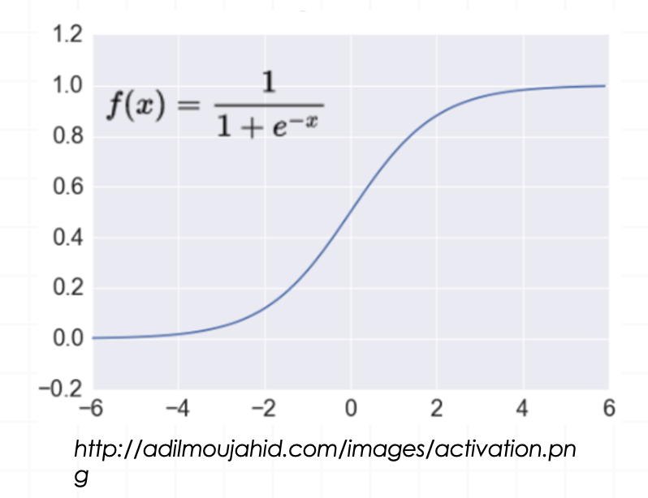
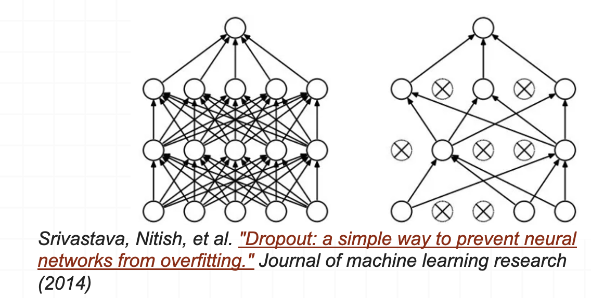
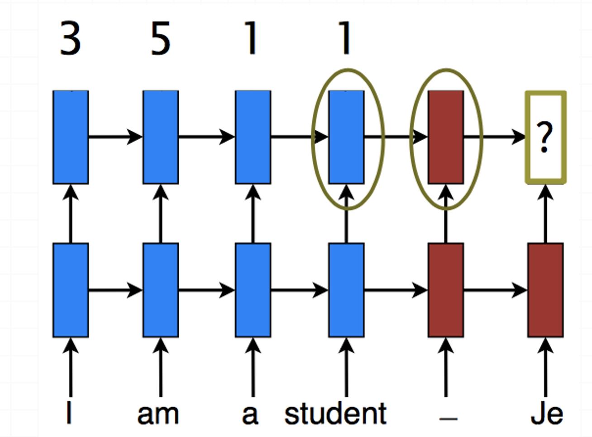

```{r, include=FALSE}
library(knitr)
library(kableExtra)
```

## Lecture plan

1. Deep learning
1. Feed-forward neural networks
2. Recurrent neural networks

## What is Deep Learning (DL)? 

A machine learning subfield of learning <span style="color:orange;">representations</span> of data. Exceptional effective at <span style="color:orange;">learning patterns</span>.

Deep learning algorithms attempt to learn (multiple levels of) representation by using a <span style="color:orange;">hierarchy of multiple layers</span>.


```{r, echo=FALSE, out.width="80%", fig.align='center'}

```

## Deep learning vs neural networks
- Deep learning is only “deep” neural networks, such that with multiple (>2) layers.

## Deep learning architechtures

- Feed-forward neural networks
- Convolutional neural networks
- Recurrent neural networks
- Self-organizing maps
- Autoencoders

## Feed-forward neural networks
- A typical multi-layer network consists of an input, hidden and output layer, each fully connected to the next, with activation feeding forward.

```{r, echo=FALSE, out.width="70%", fig.align='center'}

```

- The weights determine the function computed.

## Feed-forward neural networks

<div style="float:left;width:50%">
```{r, echo=FALSE, out.width="100%", fig.align='center'}

```
</div>
<div style="float:right;width:50%">
  <span style="color:blue">$$h = \sigma(W_1x + b_1)$$</span>
  <span style="color:green">$$y = \sigma(W_2h + b_2)$$</span>
</div>

<!-- ## Introduction -->

<!-- <div style="float:left;width:50%"> -->
<!-- ```{r, echo=FALSE, out.width="100%", fig.align='center'} -->
<!--  -->
<!-- ``` -->
<!-- </div> -->
<!-- <div style="float:right;width:50%"> -->
<!--   <span style="color:blue">$$h = \sigma(W_1x + b_1)$$</span> -->
<!--   <span style="color:green">$$y = \sigma(W_2h + b_2)$$</span> -->
<!--   <br> <br> <br> <br> -->

<!-- 4 + 2 = 6 neurons (not counting inputs) -->
<!-- <br> -->

<!-- [3 x 4] + [4 x 2] = 20 weights  -->
<!-- <br> -->

<!-- 4 + 2 = 6 biases -->
<!-- <br> -->

<!-- <span style="color:orange">26 learnable <b>parameters</b></span> -->
<!-- </div> -->

<!-- ## Introduction -->

<!-- ```{r, echo=FALSE, out.width="100%", fig.align='center'} -->
<!--  -->
<!-- ``` -->

## Feed-forward neural networks

```{r, echo=FALSE, out.width="100%", fig.align='center'}

```

<!-- ## Introduction -->

<!-- ```{r, echo=FALSE, out.width="100%", fig.align='center'} -->
<!--  -->
<!-- ``` -->

## One forward pass

```{r, echo=FALSE, out.width="100%", fig.align='center'}

```

## Hidden unit representations

- Trained hidden units can be seen as newly constructed features that make the target concept linearly separable in the transformed space.
- On many real domains, hidden units can be interpreted as representing meaningful features such as vowel detectors or edge detectors, etc..
- However, the hidden layer can also become a distributed representation of the input in which each individual unit is not easily interpretable as a meaningful feature.


<!-- ## Activation functions -->

<!-- Non-linearities needed to learn complex (non-linear) representations of data, otherwise the NN would be just a linear function $W_1W_2x = Wx$ -->

<!-- ```{r, echo=FALSE, out.width="80%", fig.align='center'} -->
<!--  -->
<!-- ``` -->

<!-- More layers and neurons can approximate more complex functions -->

<!-- Full list: https://en.wikipedia.org/wiki/Activation_function  -->

<!-- ## Activation: Sigmoid -->

<!-- <div style="float:left;width:50%"> -->
<!-- ```{r, echo=FALSE, out.width="50%", fig.align='center'} -->
<!--  -->
<!-- ``` -->
<!-- </div> -->
<!-- <div style="float:right;width:50%"> -->
<!-- Takes a real-valued number and “squashes” it into range between 0 and 1.  -->
<!-- $$R^n \rightarrow [0,1]$$ -->

<!-- <br> <br> <br>  -->
<!-- </div> -->

<!-- - $+$ Nice interpretation as the <span style="color:orange;font-weight:bold">firing rate</span> of a neuron -->
<!--   - 0 = not firing at all  -->
<!--   - 1 = fully firing -->

<!-- - $-$ Sigmoid neurons <span style="color:orange;font-weight:bold">saturate</span> and <span style="color:orange;font-weight:bold">kill gradients</span>, thus NN will barely learn -->
<!--     - when the neuron’s activation are 0 or 1 (saturate) -->
<!--         - gradient at these regions almost zero  -->
<!--         - almost no signal will flow to its weights  -->
<!--         - if initial weights are too large then most neurons would saturate -->

<!-- ## Activation: Tanh -->

<!-- <div style="float:left;width:50%"> -->
<!-- ```{r, echo=FALSE, out.width="50%", fig.align='center'} -->
<!--  -->
<!-- ``` -->
<!-- </div> -->
<!-- <div style="float:right;width:50%"> -->
<!-- Takes a real-valued number and “squashes” it into range between -1 and 1.  -->
<!-- $$R^n \rightarrow [-1,1]$$ -->

<!-- <br> <br> <br> -->
<!-- </div> -->

<!-- - Like sigmoid, tanh neurons <span style="color:orange;font-weight:bold">saturate</span> -->
<!-- - Unlike sigmoid, output is <span style="color:orange;font-weight:bold">zero-centered</span> -->
<!-- - Tanh is a <span style="color:orange;font-weight:bold">scaled sigmoid</span>: $tanha(x)=2sigm(2x)−1$ -->

<!-- ## Activation: Tanh -->

<!-- Most Deep Networks use ReLU nowadays  -->

<!-- <div style="float:left;width:50%"> -->
<!-- ```{r, echo=FALSE, out.width="50%", fig.align='center'} -->
<!--  -->
<!-- ``` -->
<!-- </div> -->
<!-- <div style="float:right;width:50%"> -->
<!-- Takes a real-valued number and thresholds it at zero $f(x) = max(0,x)$ -->
<!-- $$R^n \rightarrow R^n_+$$ -->
<!-- <br> <br> <br> -->
<!-- </div> -->

<!-- - $+$ Trains much <span style="color:orange;font-weight:bold">faster</span> -->
<!--     - accelerates the convergence of SGD -->
<!--     - due to linear, non-saturating form  -->
<!-- - $+$ Less expensive operations -->
<!--     - compared to sigmoid/tanh (exponentials etc.) -->
<!--     - implemented by simply thresholding a matrix at zero -->
<!-- - $+$ More <span style="color:orange;font-weight:bold">expressive </span> -->
<!-- - $+$ Prevents the <span style="color:orange;font-weight:bold">gradient vanishing problem</span> -->

## Overfitting
&nbsp;

Learned hypothesis may <span style="color:orange;font-weight:bold">fit</span> the training data very well, even outliers (<span style="color:orange;font-weight:bold">noise</span>) but fail to <span style="color:orange;font-weight:bold">generalize</span> to new examples (test data)

<div style="float:left;width:50%">
```{r, echo=FALSE, out.width="100%", fig.align='center'}

```
</div>
<div style="float:right;width:50%">
```{r, echo=FALSE, out.width="100%", fig.align='center'}

```
</div>

<span style="color:blue;font-weight:bold">How to avoid overfitting?</span>

## Overfitting prevention

- Running too many epochs can result in over-fitting.

```{r, echo=FALSE, out.width="80%", fig.align='center'}

```

- Keep a hold-out validation set and test accuracy on it after every epoch. Stop training when additional epochs actually increase validation error.
- To avoid losing training data for validation:
    - Use internal K-fold CV on the training set to compute the average number of epochs that maximizes generalization accuracy.
    - Train final network on complete training set for this many epochs.
    
## Regularization

<div style="float:left;width:60%">
<span style="font-weight:bold;color:orange">Dropout</span>
<ul>
    <li>Randomly drop units (along with their connections) during training</li>
    <li>Each unit retained with fixed probability $p$, independent of other units </li>
    <li><span style="color:orange">Hyper-parameter</span> $p$ to be chosen (tuned)</li>
</ul>
</div>
<div style="float:right;width:40%">
```{r, echo=FALSE, out.width="90%", fig.align='center'}

```  

<span style="font-weight:bold;color:orange">L2 = weight decay</span>
<ul>
    <li>Regularization term that penalizes big weights, added to the objective $J_{reg}(\theta) = J(\theta) + \lambda\sum_k{\theta_k^2}$ </li>
    <li>Weight decay value determines how dominant regularization is during gradient computation</li>
    <li>Big weight decay coefficient &rarr big penalty for big weights</li>
</ul>
</div>

<span style="font-weight:bold;color:orange">Early-stopping</span>
<ul>
    <li>Use validation error to decide when to stop training</li>
    <li>Stop when monitored quantity has not improved after n subsequent epochs</li>
    <li>$n$ is called patience</li>
</ul>

<!-- ## Tuning hyperparameters {.smaller} -->

<!-- ```{r, echo=FALSE, out.width="90%", fig.align='center'} -->
<!--  -->
<!-- ```   -->

<!-- ## Loss functions and output -->

<!-- ```{r, echo=FALSE, out.width="90%", fig.align='center'} -->
<!--  -->
<!-- ```   -->

<!-- ## Determining the best <br> number of hidden units -->

<!-- - Too few hidden units prevents the network from adequately fitting the data. -->
<!-- - Too many hidden units can result in over-fitting. -->

<!-- ```{r, echo=FALSE, out.width="80%", fig.align='center'} -->
<!--  -->
<!-- ```   -->

<!-- - Use internal cross-validation to empirically determine an optimal number of hidden units. -->

<!-- - Hyperparameter tuning -->

# Recurrent Neural Networks

## Recurrent Neural Network (RNN)

- Add feedback loops where some units’ current outputs determine some future network inputs.
- RNNs can model dynamic finite-state machines, beyond the static combinatorial circuits modeled by feed-forward networks. 

## Simple Recurrent Network (SRN)

- Initially developed by Jeff Elman (“*Finding structure in time*,” 1990).
- Additional input to hidden layer is the state of the hidden layer in the previous time step.

```{r, echo=FALSE, out.width="80%", fig.align='center'}

```  

## Unrolled RNN

- Behavior of RNN is perhaps best viewed by “unrolling” the network over time.

```{r, echo=FALSE, out.width="80%", fig.align='center'}

```  

## Training RNNs

- RNNs can be trained using “backpropagation through time.”
- Can viewed as applying normal backprop to the unrolled network.

```{r, echo=FALSE, out.width="80%", fig.align='center'}

```  


<!-- ## Vanishing gradient problem -->

<!-- Suppose we had the following scenario: -->

<!-- Day 1: Lift Weights -->

<!-- Day 2: Swimming -->

<!-- Day 3: At this point, our model must decide whether we should take a rest day or yoga. Unfortunately, it only has access to the previous day. In other words, it knows we swam yesterday but it doesn’t know whether had taken a break the day before. Therefore, it can end up predicting yoga. -->

<!-- - Backpropagated errors multiply at each layer, resulting in exponential decay (if derivative is small) or growth (if derivative is large). -->
<!-- - Makes it very difficult train deep networks, or simple recurrent networks over many time steps. -->
<!-- - LSTMs were invented, to get around this problem. -->

<!-- <font size="2"> https://towardsdatascience.com/ </font> -->

<!-- ## Long distance dependencies -->

<!-- - It is very difficult to train SRNs to retain information over many time steps -->
<!-- - This make is very difficult to learn SRNs that handle long-distance dependencies, such as subject-verb agreement. -->

<!-- ```{r, echo=FALSE, out.width="80%", fig.align='center'} -->
<!--  -->
<!-- ```   -->

## Long Short Term Memory (LSTM)

- LSTM networks, add additional gating units in each memory cell.
    - Forget gate
    - Input gate
    - Output gate
- Prevents vanishing/exploding gradient problem and allows network to retain state information over longer periods of time.

## LSTM network architecture | <font size="4"> https://colah.github.io/posts/2015-08-Understanding-LSTMs/  </font>

```{r, echo=FALSE, out.width="100%", fig.align='center'}

```  

<!-- ## Bi-directional LSTM (Bi-LSTM) -->

<!-- - Separate LSTMs process sequence forward and backward and hidden layers at each time step are concatenated to form the cell output. -->

<!-- ```{r, echo=FALSE, out.width="80%", fig.align='center'} -->
<!--  -->
<!-- ```   -->


<!-- ## Advanced models -->

<!-- - For many applications, it helps to add “attention” to RNNs. -->
<!-- - Allows network to learn to attend to different parts of the input at different time steps, shifting its attention to focus on different aspects during its processing. -->
<!-- - Used in image captioning to focus on different parts of an image when generating different parts of the output sentence. -->
<!-- - In MT, allows focusing attention on different parts of the source sentence when generating different parts of the translation. -->

<!-- ## Attention mechanism -->

<!-- ```{r, echo=FALSE, out.width="80%", fig.align='center'} -->
<!--  -->
<!-- ```   -->

<!-- ## Attention: Scoring -->

<!-- ```{r, echo=FALSE, out.width="80%", fig.align='center'} -->
<!--  -->
<!-- ```   -->

<!-- $$score(h_{t-1},\bar{h}_s) = h_t^T\bar{h}_s$$ -->

<!-- <span style="color:orange;font-weight:bold">Compare</span> target and source hidden states -->

<!-- ## Attention: Scoring -->

<!-- ```{r, echo=FALSE, out.width="70%", fig.align='center'} -->
<!--  -->
<!-- ```   -->

<!-- $$score(h_{t-1},\bar{h}_s) = h_t^T\bar{h}_s$$ -->

<!-- <span style="color:orange;font-weight:bold">Compare</span> target and source hidden states -->

<!-- ## Attention: Normalization -->

<!-- ```{r, echo=FALSE, out.width="65%", fig.align='center'} -->
<!--  -->
<!-- ```   -->

<!-- $$a_t(s) = \frac{e^{score(s)}}{\sum_{s'}{e^{score(s')}}}$$ -->

<!-- <span style="color:orange;font-weight:bold">Convert</span> into alignment weights -->

<!-- ## Attention: Context -->

<!-- ```{r, echo=FALSE, out.width="60%", fig.align='center'} -->
<!--  -->
<!-- ```   -->

<!-- $$c_t = \sum_s{a_t(s)\bar{h}_s}$$ -->

<!-- Build <span style="color:orange;font-weight:bold">context</span> vector: weighted average -->

<!-- ## Attention: Context -->

<!-- ```{r, echo=FALSE, out.width="60%", fig.align='center'} -->
<!--  -->
<!-- ```   -->

<!-- $$h_t = f(h_{t-1}, c_t, e_t)$$ -->

<!-- Compute <span style="color:orange;font-weight:bold">next</span> hidden state -->

## In R
```{r 10, message = FALSE, warning = FALSE, eval = FALSE}
# Use Keras Functional API 
input <- layer_input(shape = list(maxlen), name = "input")

model <- input %>%
  layer_embedding(input_dim = max_words, output_dim = dim_size, input_length = maxlen,
                  weights = list(word_embeds), trainable = FALSE) %>%
  layer_lstm(units = 80, return_sequences = TRUE)

output <- model                 %>%
  layer_global_max_pooling_1d() %>%
  layer_dense(units = 1, activation = "sigmoid")

model <- keras_model(input, output)

summary(model)
```

## In R
```{r, echo=FALSE, out.width="80%", fig.align='center'}
include_graphics("img/summary.jpg")
```  

## In R
```{r 11, message = FALSE, warning = FALSE, eval = FALSE}
# instead of accuracy we can use "AUC" metrics from "tensorflow.keras"
model %>% compile(
  optimizer = "adam", 
  loss = "binary_crossentropy",
  metrics = tensorflow::tf$keras$metrics$AUC() # metrics = c('accuracy')
)
```

## In R
```{r 12, message = FALSE, warning = FALSE, eval = FALSE}
history <- model %>% keras::fit(
  x_train, y_train,
  epochs = 10,
  batch_size = 32,
  validation_split = 0.2
)
```

# Summary

## Summary

- Deep learning
- Feed-forward neural networks
- Recurrent neural networks

# Practical 8