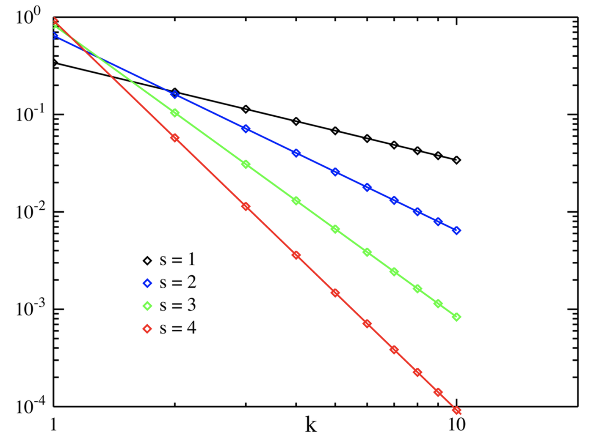

```{r, include=FALSE}
library(knitr)
library(DiagrammeR)
```

## Lecture’s Plan

1. How to represent a document?

2. What are vector space and bag-of-words models?

3. Features in text? And how to do text feature selection?

4. How to classify text data?

5. How to evaluate a classifier?

# Text Classification

## Text classification

- Supervised learning: Learning a function that maps an input to an output based on example input-output pairs.
  
  - infer a function from labeled training data
  
  - use the inferred function to label new instances

- Human experts annotate a set of text data
  
  - Training set

```{r, echo=FALSE, out.width="40%"}

```

<!-- ## Applications -->

<!-- - Assigning subject categories, topics, or genres -->

<!-- - Spam detection -->

<!-- - Authorship identification -->

<!-- - Age/gender identification -->

<!-- - Language Identification -->

<!-- - Sentiment analysis -->

<!-- - … -->

## Text classification?

- Which problem is not a text classification task? (less likely to be)

  - Author's gender detection from text
  
  - Finding about the smoking conditions (yes/no) of patients from clinical letters

  - Grouping similar news articles

  - Classifying reviews into positive and negative sentiment

<br>
<br>
Go to <a href="www.menti.com">www.menti.com</a> and use the code 9594 3321

## Pipeline
```{r, echo=FALSE}
grViz("digraph {

graph [layout = dot, rankdir = LR]

node [shape = rectangle, style = filled, fillcolor = Linen]

text [label = 'Text Collection', shape = folder, fillcolor = Beige]

repre [label =  'Text \n Representation']
class [label = 'Classification \n (Model Training)']
pred [label= 'Prediction \n (Test Data)']

# edge definitions with the node IDs
text  -> repre -> class -> pred
}")
```

# Text Representation

## How to represent a document

- Represent by a string?
  
  - No semantic meaning

- Represent by a list of sentences?

  - Sentence is just like a short document (recursive definition)

- Represent by a vector?
  
  - A vector is an ordered finite list of numbers.

## Vector space model

- A vector space is a collection of vectors

- Represent documents by <u>concept</u> vectors
  
  - Each concept defines one dimension

  - k concepts define a high-dimensional space
  
  - Element of vector corresponds to concept weight	


## Vector space model

- Distance between the vectors in this concept space

  - Relationship among documents

- The process of converting text into numbers is called <b>Vectorization</b>

## Vector space model

- Terms are generic features that can be extracted from text

- Typically, terms are single words, keywords, n-grams, or phrases

- Documents are represented as vectors of terms

- Each dimension (concept) corresponds to a separate term

$$d = (w_1, ..., w_n)$$

<!-- \newpage -->

<!-- ## Vector space model -->

<!-- - The Corpus represents a collection of documents (the dataset) -->

<!-- - The Vocabulary is the set of all unique terms in the corpus -->

## An illustration of VS model 

- All documents are projected into this concept space

```{r,echo=FALSE, out.width="70%"}
include_graphics("img/page 8.png")
```

## Vector space model

- Bag of Words

- Topics

- Word Embeddings

## Bag of Words (BOW)

- With Bag of Words (BOW), we refer to a Vector Space Model where:
  
  - Terms: words (more generally we may use n-grams, etc.)
  
  - Weights: number of occurrences of the terms in the document

## BOW representation

- Term as the basis for vector space

  - Doc1: Text mining is to identify useful information.
  
  - Doc2: Useful information is mined from text.
  
  - Doc3: Apple is delicious.

```{r, echo= FALSE, out.width="100%"}

```

<!-- ## Zipf’s law | A statistical property of language -->

<!-- - Zipf’s law -->

<!--   - Frequency of any word is inversely proportional to its rank in the frequency table -->
<!--   - Formally -->
<!--     - $f(k;s,N)=\frac{1/k^S}{\sum^N_{n=1}{1/n^S}}$ <br> -->
<!--     where $k$ is rank of the word; $N$ is the vocabulary size; $s$ is language-specific parameter -->
<!--   - Simply: $f(l;s,N)\propto1/k^S$ -->

<!-- ## Zipf’s law -->

<!-- ```{r, echo=FALSE, out.width="60%"} -->
<!--  -->
<!-- ``` -->

<!-- <br> -->
<!-- <p style="float: right;font-size:12px">Source:https://en.wikipedia.org/wiki/Zipf's_law</p> -->
  
<!-- ## Zipf’s law -->

<!-- <!-- - The most frequent word occurs 90,000 times, the second one 45,000 times, the third 30,000, and so on. --> -->

<!-- - In a clinical text dataset, if we know the most popular word’s frequency is 69,542, what is your best estimate of its second and third most popular word’s frequencies respectively?  -->

<!-- Zipf’s law tells us: -->

<!-- - Head words take large portion of occurrences, but they are semantically meaningless -->
<!-- E.g., the, a, an, we, do, to -->
<!-- - Tail words take major portion of vocabulary, but they rarely occur in documents -->
<!-- E.g., Pneumonoultramicroscopicsilicovolcanoconiosis (45 letters, a lung disease) -->
<!-- - The rest is most representative -->

## BOW weights: Binary

- <b><span style="font-size:20px">Binary</span></b>

  - with 1 indicating that a term occurred in the document, and 0 indicating that it did not

## BOW weights: Term frequency

- Idea: a term is more important if it occurs more frequently in a document

- TF Formulas
  
  - Let $t(c,d)$ be the frequency count of term $t$ in doc $d$

  - Raw TF: $tf(t,d) = c(t,d)$

## BOW weights: TFiDF
- Idea: a term is more discriminative if it occurs a lot but only in fewer documents

Let $n_{d,t}$ denote the number of times the $t$-th term appears in the $d$-th document.

$$TF_{d,t} = \frac{n_{d,t}}{\sum_i{n_{d,i}}}$$
Let $N$ denote the number of documents annd $N_t$ denote the number of documents containing the $t$-th term.

$$IDF_t = log(\frac{N}{N_t})$$
TF-IDF weight: 

$$w_{d,t} = TF_{d,t} \cdot IDF_t$$

<!-- ## Similarity metric -->

<!-- - Euclidean distance -->

<!--   - $dist(d_i, d_j) = \sqrt{\sum_{t\in V}{[tf(t,d_i)idf(t) - tf(t, d_j)idf(t)]^2}}$ -->

<!--   - Longer documents will be penalized by the extra words -->

<!--   - We care more about how these two vectors are overlapped -->

## In R

```{r}
library(tm)
data <- c('Text mining is one of the Utrecht summer school courses.', 
          'There are other data science courses in Utrecht summer school')

# convert data to vector space model
corpus <- VCorpus(VectorSource(data))

# create a dtm object
dtm <- DocumentTermMatrix(corpus, 
                          list(removePunctuation = TRUE, 
                               stopwords = TRUE, 
                               stemming = TRUE, 
                               removeNumbers = TRUE))
```


## In R
```{r}
inspect(dtm)
```


# Feature Selection

## Feature selection for text classification

- Feature selection is the process of selecting a specific subset of the terms of the training set and using only them in the classification algorithm.

- high dimensionality of text features

- Select the most informative features for model training
  
  - Reduce noise in feature representation
  
  - Improve final classification performance
  
  - Improve training/testing efficiency
  
    - Less time complexity
    
    - Fewer training data

## Feature selection methods

- Wrapper methods
  - Find the best subset of features for a particular classification method
  - Sequential forward selection or genetic search to speed up the search

- Filter methods
  - Evaluate the features <u>independently</u> from the classifier and other features
  - Feasible for very large feature se
  - Usually used as a preprocessing step
  
- Embedded methods
 - e.g. Regularized regression, Regularized SVM

<!-- ```{r,echo=FALSE, out.width="70%", fig.align='center'} -->
<!--  -->
<!-- ``` -->

<!-- ## Feature selection methods -->

<!-- - Filter method -->

<!--   - Evaluate the features <u>independently</u> from the classifier and other features -->

<!--     - No indication of a classifier’s performance on the selected features -->

<!--     - No dependency among the features -->

<!--   - Feasible for very large feature set -->

<!--     - Usually used as a preprocessing step -->

<!-- ```{r,echo=FALSE, out.width="90%", fig.align='center'} -->
<!-- include_graphics("img/page 37.png") -->
<!-- ``` -->

## Document frequency

- Rare words: non-influential for global prediction, reduce vocabulary size

```{r,echo=FALSE, out.width="90%", fig.align='center'}

```

## Information gain

- Decrease in entropy of categorical prediction when the feature is present or absent

```{r,echo=FALSE, out.width="90%", fig.align='center'}

```

## Gini Index

Let $p(c | t)$ be the conditional probability that a document belongs to class $c$, given the fact that it contains the term $t$. Therefore, we have:

$$\sum^k_{c=1}{p(c | t)=1}$$

Then, the gini-index for the term $t$, denoted by $G(t)$ is defined as:

$$G(t) = \sum^k_{c=1}{p(c | t)^2}$$

## Gini Index

- The value of the gini-index lies in the range $(1/k, 1)$. 

- Higher values of the gini-index indicate a greater discriminative power of the term t. 

- If the global class distribution is skewed, the gini-index may not accurately reflect the discriminative power of the underlying attributes.

- Other methods
  - Normalized gini-index
  - Mutual Information
  - ${\chi}^2$-Statistic

# Classification Algorithms

## How to classify this document? 

```{r, echo=FALSE, out.width="100%"}
include_graphics("img/page 53.png")
```

## Text Classification: definition

- Input:
 
  - A training set of $m$ manually-labeled documents $(d_1,c_1),\cdots,(d_m,c_m)$
  
  - a fixed set of classes $C = \{c_1, c_2,…, c_J\}$
  
- Output:

  - a learned classifier $y:d \rightarrow c$
  
## Hand-coded rules

- Rules based on combinations of words or other features

- Rules carefully refined by expert

- But building and maintaining these rules is expensive

- Data/Domain specifics

- Not recommended!

## Supervised Machine Learning
- Logistic regression
- K-nearest neighbors
- Naïve Bayes
- Support vector machines
- Neural networks

## Rocchio Classifier (Nearest Centroid)

Each class is represented by its centroid, with test samples classified to the class with the nearest centroid. Using a training set of documents, the Rocchio algorithm builds a prototype vector, centroid, for each class. This prototype is an average vector over the training documents’ vectors that belong to a certain class. 

$$\boldsymbol{\mu_c} = \frac{1}{|D_c|}\sum_{\mathbf{d} \in D_c}{\mathbf{d}}$$

Where $D_c$ is the set of documents in the corpus that belongs to class $c$ and $d$ is the vector representation of document $d$.

## Rocchio Classifier (Nearest Centroid)

The predicted label of document d is the one with the smallest (Euclidean) distance between the document and the centroid.

$$\hat{c} = \arg \min_c ||\boldsymbol{\mu_c} - \mathbf{d}||$$

## K-Nearest Neighbor 

- Given a test document d,. the KNN algorithm finds the k nearest neighbors of d among all the documents in the training set, and scores the category candidates based on the class of the k neighbors. 

- After sorting the score values, the algorithm assigns the candidate to the class with the highest score. 

- The basic nearest neighbors classification uses uniform weights: that is, the value assigned to a query point is computed from a simple majority vote of the nearest neighbors. C

- Can weight the neighbors such that nearer neighbors contribute more to the fit. 

## K-Nearest Neighbor

```{r, echo=FALSE, out.width="80%", fig.align='center'}

```

## Naïve Bayes

```{r, echo=FALSE, out.width="100%"}

```

## Bayes’ Rule 

- Applied to documents and classes

- For a document $d$ and a class $c$

$$P(c|d) = \frac{P(d|c)P(c)}{P(d)}$$

## Multinomial Naïve Bayes Independence Assumptions

- <b>Bag of Words assumption</b>: Assume position doesn’t matter

- <b>Conditional Independence</b>: Assume the feature probabilities $P(w_i|c_j)$ are independent given the class $c$.

$$P(w_1, \ldots, w_n|c) = P(w_1 | c) \cdot P(w_2|c) \cdot P(w_3|c) \cdot \ldots \cdot P(w_n|c)$$
\newpage 

## Multinomial Naïve Bayes Classifier

$$C_{MAP} = \underset{c \in C}{\operatorname{argmax}}P(w_1, w_2, \ldots,w_n|c)P(c)$$

$$C_{NB} = \underset{c \in C}{\operatorname{argmax}}P(c_j)\prod_{w \in V}{P(w|c)}$$
$$C_{NB} = \underset{c \in C}{\operatorname{argmax}}P(c_j)\prod_{i \in positions}{P(w_i|c_i)}$$
\newpage

## Parameter estimation

- First attempt: maximum likelihood estimates

  - simply use the frequencies in the data

$$\hat{P}(c_j) = \frac{doccount(C = c_j)}{N_{doc}}$$
$$\hat{P}(w_i|c_j) = \frac{count(w_i, c_j)}{\sum_{w \in V}count(w, c_j)}$$

- fraction of times word $w_i$ appears among all words in documents of topic $c_j$

\newpage

## Problem with Maximum Likelihood

What if we have seen no training documents with the word <b>coffee</b>  and classified in the topic <b>positive (thumbs-up)</b>?

$$\hat{P}(\mathrm{''coffee''|positive}) = \frac{count(\mathrm{''coffee'', positive})}{\sum_{w \in V}{count(\mathrm{w,positive})}}$$
Zero probabilities cannot be conditioned away, no matter the other evidence!

$$C_{MAP} = \underset{c}{\operatorname{argmax}}\hat{P}(c)\prod_i{\hat{P}(w_i|c)}$$
\newpage

## Laplace (add-1) smoothing for Naïve Bayes
$$
\begin{align}
\hat{P}(w_i|c) &= \frac{count(w_i,c)+1}{\sum_{w \in V}{(count(w,c)+1)}} \\
&= \frac{count(w_i,c)+1}{(\sum_{w \in V}{count(w,c) + |V|})}
\end{align}
$$
\newpage

## Multinomial Naïve Bayes: Learning
- From training corpus, extract <em>Vocabulary</em>

<div style="float:left;width:50%">
- Calculate $P(c_j)$ terms
  - For each $c_j$ in $C$ do
  
  $docs_j\leftarrow$ all docs with class = $c_j$
  
  $$P(c_j) \leftarrow \frac{|docs_j|}{|total\ \#\ documents|}$$
</div>
  
<div style="float:right;width:50%">
- Calculate $P(w_k|c_j)$ terms</p>
  - $Text_j \leftarrow$ single doc containing all $docs_j$
  
  - For each word $w_k$ in <em>Vocabulary</em>
  
    $n_k \leftarrow$ # of occurrences of $w_k$ in $Text_j$
    
  $$P(w_k|c_j) \leftarrow \frac{n_k + \alpha}{n + \alpha|Vocabulary|}$$
</div>

\newpage

## Decision Tree 

- A decision tree is a hierarchical decomposition of the (training) data space, in which a condition on the feature value is used in order to divide the data space hierarchically. 

- Top-down, by choosing a variable at each step that best splits the set of items. 
- Different algorithms to measure the homogeneity of the target variable within the subsets.
  - Gini impurity
  - Information gain

\newpage

## Random Forest

- Random forests are an ensemble learning method for classification, regression and other tasks that operates by constructing a multitude of decision trees at training time.
- Fit multiple trees to bootstrapped samples of the data AND at each node select best predictor from only a random subset of predictors. Combine all trees to yield a consensus prediction


```{r, echo=FALSE, out.width="55%", fig.align='center'}

```

## Support Vector Machine

- The main principle of SVM is to determine separators in the search space which can best separate the different classes.
- SVM tries to make a decision boundary in such a way that the separation between the two classes is as wide as possible.

```{r, echo=FALSE, out.width="50%", fig.align='right'}

```

\newpage

## Support Vector Machine

- It is not necessary to use a linear function for the SVM classifier. 
- With the kernel trick, SVM can construct a nonlinear decision surface in the original feature space by mapping the data instances non-linearly to a new space where the classes can be separated linearly with a hyperplane. 

- In practice, linear SVM is used most often because of their simplicity and ease of interpretability.
- SVM is quite robust to high dimensionality.

```{r, echo=FALSE, out.width="50%", fig.align='right'}

```

\newpage


# Evaluation

## Data Splitting

- Training set
  - Validation set (dev set)
    - A validation dataset is a dataset of examples used to tune the hyperparameters (i.e. the architecture) of a classifier. It is sometimes also called the development set or the "dev set".
    
- Test set

## Cross Validation

```{r, echo=FALSE, out.width="75%"}

```

<br>
<p style="font-size:12px">https://scikit-learn.org/stable/modules/cross_validation.html</p>


## Confusion matrix

```{r, echo=FALSE, out.width="100%"}

```

\newpage

## Accuracy

- What proportion of instances is correctly classified? <br>
 	<center>TP + TN / TP + FP + FN + TN </center>

- Accuracy is a valid choice of evaluation for classification problems which are well balanced and not skewed. 

- Let us say that our target class is very sparse. Do we want accuracy as a metric of our model performance? What if we are predicting if an asteroid will hit the earth? Just say “No” all the time. And you will be 99% accurate. The model can be reasonably accurate, but not at all valuable.

\newpage

## Precision and recall

- <b>Precision</b>: % of selected items that are correct <br> <b>Recall</b>: % of correct items that are selected

- Precision is a valid choice of evaluation metric when we want to be very sure of our prediction.

- Recall is a valid choice of evaluation metric when we want to capture as many positives as possible.

\newpage

## A combined measure: F

A combined measure that assesses the P/R tradeoff is F measure (weighted harmonic mean):

$$F = \frac{1}{\alpha\frac{1}{P}+(1-\alpha)\frac{1}{R}}=\frac{(\beta^2+1)PR}{\beta^2P + R}$$

The harmonic mean is a very conservative average;

Balanced F1 measure
  -   i.e., with $\beta = 1$ (that is, $\alpha = 1/2$): $F = 2PR/(P+R)$
  
# The Real World

## No training data? 

- Manually written rules

  - <p style="color:green">If (x or y) and not (w or z) then categorize as class1</p>

  - Need careful crafting

  - Low accuracy

  - Domain-specific

  - Time-consuming

- Active learning

- Unsupervised methods

\newpage

## Very little data?

- Use Naïve Bayes, KNN, Rocchio
  
  - Naïve Bayes is a “high-bias” algorithm <span style="color:green; font-size:12px">(Ng and Jordan 2002 NIPS)</span>

- Get more labeled data 
  
- Find ways to label data for you

- Try semi-supervised methods:
  
  - e.g. active learning, bootstrapping

\newpage

## A reasonable amount of data?

- Perfect for all the complex classifiers
  
  - SVM
  
  - Regularized Logistic Regression

  - Random forest

\newpage

## A huge amount of data?

- Can achieve high accuracy!

- At a cost:

  - SVMs (train time) or KNN (test time) can be too slow
  - Regularized logistic regression
  - Naïve Bayes again!
  - Deep learning

\newpage

## Accuracy as a function of data size
<div style="float:left; width:50%">
- With enough data
  
  - Classifier may not matter
</div>
<div style="float:right; width:50%">
```{r,echo=FALSE, out.width="100%"}

```
</div>

https://aclanthology.org/P01-1005.pdf

\newpage

## How to tweak performance
- Domain-specific features and weights: very important in real performance

- Sometimes need to collapse terms:
  
  - Part numbers, chemical formulas, …
  
  - But stemming generally doesn’t help

- Upweighting: Counting a word as if it occurred twice:
  - Title words

  - First sentence of each paragraph (Murata, 1999)
  
  - In sentences that contain title words
  
- Hyperparameter optimization

# Terminology

## Some terminology {.smaller}
- <p style="font-size:16px"><u><b>Corpus</b></u>: is a large and structured set of texts</p>
- <p style="font-size:16px"><u><b>Stop words</b></u>:  words which are filtered out before or after processing of natural language data (text)</p>
- <p style="font-size:16px"><u><b>Unstructured text</b></u>: information that either does not have a pre-defined data model or is not organized in a pre-defined manner.</p>
- <p style="font-size:16px"><u><b>Tokenizing</b></u>: process of breaking a stream of text up into words, phrases, symbols, or other meaningful elements called tokens (see also lexical analysis)</p>
- <p style="font-size:16px"><u><b>Natural language processing</b></u>: field of computer science, artificial intelligence, and linguistics concerned with the interactions between computers and human (natural) languages</p>
- <p style="font-size:16px"><u><b>Term document (or document term) matrix</b></u>:  is a mathematical matrix that describes the frequency of terms that occur in a collection of documents</p>
- <p style="font-size:16px"><u><b>Supervised learning</b></u>: is the machine learning task of inferring a function from labeled training data</p>
- <p style="font-size:16px"><u><b>Unsupervised learning</b></u>: find hidden structure in unlabeled data</p>

\newpage

# Summary

## Summary

- Vector space model & BOW

- Feature Selection

- Text Classification

- Evaluation

# Practical 3
