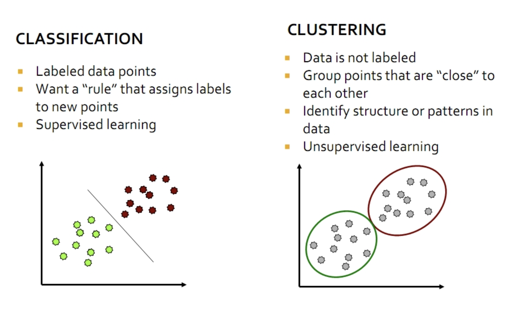

```{r, include=FALSE}
library(knitr)
library(DiagrammeR)
library(kableExtra)
library(magick)
library(magrittr)
```

## Lecture Plan

1. Features in text? And how to do text feature selection?

2. What is text clustering?

3. What are the applications?

4. How to cluster text data?

# Feature Selection

## Feature selection for text classification

- Feature selection is the process of selecting a specific subset of the terms of the training set and using only them in the classification algorithm.

- high dimensionality of text features

- Select the most informative features for model training
  
  - Reduce noise in feature representation
  
  - Improve final classification performance
  
  - Improve training/testing efficiency
  
    - Less time complexity
    
    - Fewer training data

## Feature selection methods

- Wrapper methods
  - Find the best subset of features for a particular classification method
  - Sequential forward selection or genetic search to speed up the search

- Filter methods
  - Evaluate the features <u>independently</u> from the classifier and other features
  - Feasible for very large feature se
  - Usually used as a preprocessing step
  
- Embedded methods
 - e.g. Regularized regression, Regularized SVM

<!-- ```{r,echo=FALSE, out.width="70%", fig.align='center'} -->
<!--  -->
<!-- ``` -->

<!-- ## Feature selection methods -->

<!-- - Filter method -->

<!--   - Evaluate the features <u>independently</u> from the classifier and other features -->

<!--     - No indication of a classifier’s performance on the selected features -->

<!--     - No dependency among the features -->

<!--   - Feasible for very large feature set -->

<!--     - Usually used as a preprocessing step -->

<!-- ```{r,echo=FALSE, out.width="90%", fig.align='center'} -->
<!-- include_graphics("img/page 37.png") -->
<!-- ``` -->

## Document frequency

- Rare words: non-influential for global prediction, reduce vocabulary size

```{r,echo=FALSE, out.width="90%", fig.align='center'}
include_graphics("img/page 38.png")
```

## Information gain

- Decrease in entropy of categorical prediction when the feature is present or absent

```{r,echo=FALSE, out.width="90%", fig.align='center'}

```

## Gini Index

Let $p(c | t)$ be the conditional probability that a document belongs to class $c$, given the fact that it contains the term $t$. Therefore, we have:

$$\sum^k_{c=1}{p(c | t)=1}$$

Then, the gini-index for the term $t$, denoted by $G(t)$ is defined as:

$$G(t) = \sum^k_{c=1}{p(c | t)^2}$$

## Gini Index

- The value of the gini-index lies in the range $(1/k, 1)$. 

- Higher values of the gini-index indicate a greater discriminative power of the term t. 

- If the global class distribution is skewed, the gini-index may not accurately reflect the discriminative power of the underlying attributes.

- Other methods
  - Normalized gini-index
  - Mutual Information
  - ${\chi}^2$-Statistic

# Text Clustering

## Unsupervised learning
```{r, out.width="100%"}

```

## Clustering versus classification
```{r, echo=FALSE, out.width="100%"}

```

## Clustering
- Clustering: the process of grouping a set of objects into clusters of similar objects

- Discover “natural structure” of data
  
  - What is the criterion? 
  - How to identify them?
  - How to evaluate the results?

```{r, echo=FALSE, out.width="100%"}

```

## Question

Which one is not a text clustering task?

- Grouping Trump's tweets and finding the main topics
- Finding similar patterns (demands) in customer reviews
- Grouping scientific articles
- Detection of heart failure (0 or 1) using discharge summaries

Please go to <a href="www.menti.com">www.menti.com</a> and use the code 9594 3321

## Clustering
  
- Basic criteria

  - high intra-cluster similarity

  - low inter-cluster similarity

- No (little) supervision signal about the underlying clustering structure

- Need similarity/distance as guidance to form clusters

## Applications of text clustering
<div style="float:left; width:50%">
- Organize document collections
  
  - Automatically identify hierarchical/topical relation among documents
</div>
<div style="float:right; width:60%">
```{r, echo=FALSE, out.width="100%"}

```
</div>

## Applications of text clustering
<div style="float:left; width:50%">
- Grouping search results
  
  - Organize documents by topics
  
  - Facilitate user browsing
</div>
<div style="float:right; width:50%">
```{r, echo=FALSE, out.width="100%"}

```
</div>

## Applications of text clustering
- Topic modeling
  - Grouping words into topics
  
```{r, echo=FALSE, out.width="100%"}

```

<!-- # Distance metric -->

<!-- ## Distance metric -->
<!-- - Basic properties -->

<!--   - Positive separation -->
<!--     - $𝐷(x,y)>0, \forall x \neq y$ -->
<!--     - $𝐷(x,y)=0, \mathrm{i.f.f.}, x=y$ -->

<!--   - Symmetry  -->
<!--     - $𝐷(x,y)=𝐷(y,x)$ -->

<!--   - Triangle inequality -->
<!--     - $𝐷(x,y)≤𝐷(x,z)+𝐷(z,y)$ -->

<!-- ## Typical distance metric -->
<!-- - Minkowski metric -->

<!--   - $d(x,y) = \sqrt[p]{\sum^V_{i=1}{(x_i-y_i)^p}}$ -->

<!--     - When $p=2$, it is <span style="color:red">Euclidean distance</span> -->

<!-- - Cosine metric -->

<!--   - $𝑑(x,y)=1−cosine(x,y)$ -->

<!--     - when $|x|^2=|y|^2=1$, $1−cosine(x,y)=\frac{r^2}{2}$ -->

<!-- ## Typical distance metric -->
<!-- - Edit distance -->

<!--   - Count the minimum number of operations required to transform one string into the other -->

<!--     - Possible operations: insertion, deletion and replacement -->

<!-- <div style="float:left; width:70%"> -->
<!-- ```{r, echo=FALSE, out.width="70%", fig.align='right'} -->
<!--  -->
<!-- ``` -->
<!-- </div> -->
<!-- <div style="float:right; width:30%"> -->
<!-- <br> <br> <br> <br>  -->
<!-- <p style="color:red">&larr; Can be efficiently solved by dynamic programming -->
<!-- </p> -->
<!-- </div> -->

<!-- ## Typical distance metric -->
<!-- - Edit distance -->

<!--   - Count the minimum number of operations required to transform one string into the other -->

<!--     - Possible operations: insertion, deletion and replacement -->

<!--   - Extent to distance between sentences -->

<!--     - Word similarity as cost of replacement -->

<!--       - “terrible” -> “bad”: low cost <span style="color:red">&rarr; Lexicon or distributional semantics</span> -->

<!--       - “terrible” -> “terrific”: high cost <span style="color:red">&rarr; Lexicon or distributional semantics</span> -->

<!--     - Preserving word order in distance computation -->

# Clustering algorithms

## Categories

- Partitional clustering

- Hierarchical clustering

- Topic modeling

<!-- <ol> -->
<!--   <li>Partitional clustering algorithms</li> -->
<!--   <ul> -->
<!--     <li>Partition the instances into different groups</li> -->
<!--     <li>Flat structure</li> -->
<!--     <ul> -->
<!--       <li>Need to specify the number of classes in advance</li> -->
<!--     </ul> -->
<!--   </ul> -->
<!-- </ol> -->

<!-- ## Clustering algorithms -->
<!-- <ol start="2"> -->
<!--   <li>Hierarchical clustering algorithms</li> -->
<!--   <ul> -->
<!--     <li>Create a hierarchical decomposition of objects</li> -->
<!--     <li>Rich internal structure</li> -->
<!--     <ul> -->
<!--       <li>No need to specify the number of clusters</li> -->
<!--       <li>Can be used to organize objects</li> -->
<!--     </ul> -->
<!--   </ul> -->
<!-- </ol> -->

<!-- ## Clustering algorithms -->
<!-- <ol start="3"> -->
<!--   <li>Topic modeling</li> -->
<!--   <ul> -->
<!--     <li>Topic models are a suite of algorithms that uncover the hidden thematic structure in document collections. These algorithms help us develop new ways to search, browse and summarize large archives of texts.</li> -->
<!--     <li>We want to find themes (or topics) in documents</li> -->
<!--     <li>We don’t want to do supervised topic classification – rather not fix topics in advance nor do manual annotation </li> -->
<!--     <li>Need an approach which automatically teases out the topics</li> -->
<!--     <li>This is essentially a clustering problem - can think of both words and documents as being clustered</li> -->
<!--   </ul> -->
<!-- </ol> -->

## Hard versus soft clustering
- Hard clustering: Each document belongs to exactly one cluster
  
  - More common and easier to do

- Soft clustering: A document can belong to more than one cluster.
  

# Partitional clustering

## Partitional clustering algorithms
- Partitional clustering method: Construct a partition of <span style="color:lightgreen">$n$</span> documents into a set of <span style="color:lightgreen">$K$</span> clusters
- Given: a set of documents and the number <span style="color:lightgreen">$K$</span> 
- Find: a partition of <span style="color:lightgreen">$K$</span> clusters that optimizes the chosen partitioning criterion

  - Globally optimal
    - Intractable for many objective functions
    - Ergo, exhaustively enumerate all partitions
  
  - Effective heuristic methods: <em>K</em>-means and <em>K</em>-medoids algorithms
  
## Partitional clustering algorithms
- Typical partitional clustering algorithms
  
  - <em>k</em>-means clustering
    
    - Partition data by its closest mean

```{r, echo=FALSE, out.width="70%", fig.align='right'}
include_graphics("img/page 22.png")
```

<!-- ## Partitional clustering algorithms -->
<!-- <div style="float:left;width:70%"> -->
<!-- - Typical partitional clustering algorithms -->

<!--   - <em>k</em>-means clustering -->

<!--     - Partition data by its closest mean -->

<!--   - Gaussian Mixture Model -->

<!--     - Consider variance within the cluster as well -->
<!-- </div> -->
<!-- <div style="float:right;width:30%"> -->
<!-- ```{r, echo=FALSE,out.width="100%"} -->
<!--  -->
<!-- ``` -->
<!-- </div> -->

## K-Means algorithm
- Assumes documents are real-valued vectors.

- Clusters based on <span style="font-style:italic;color:red">centroids</span> of points in a cluster, $c$:

$$\vec \mu(c)=\frac{1}{|c|}\sum_{\vec a \in c}{\vec x}$$

- Reassignment of instances to clusters is based on distance to the current cluster centroids.
  

## K-Means algorithm
- Select $K$ random docs $\{s_1, s_2,… s_K\}$ as seeds.
- Until clustering converges (or other stopping criterion):
  
  - For each doc $d_i$: <br>
   
    - Assign $d_i$ to the cluster $c_j$ such that $dist(x_i, s_j)$ is minimal.
  
  - <span style="color:DarkCyan">(Next, update the seeds to the centroid of each cluster)</span>
  
  - For each cluster cj
    - $s_j = \mu(c_j)$
    
## K-Means example (K=2)
```{r, out.width="100%", cache=TRUE}
list.files(path='img/', pattern = 'page 26', full.names = TRUE) %>% 
        image_read() %>% # reads each path file
        image_join() %>% # joins image
        image_animate(fps=.25) %>% # animates, can opt for number of loops
        image_write("img/kmeans.gif") # write to current dir


```

<!-- ## Termination conditions -->
<!-- - Several possibilities, e.g., -->

<!--   - A fixed number of iterations. -->

<!--   - Doc partition unchanged. -->

<!--   - Centroid positions don’t change. -->

<!-- ## Convergence -->
<!-- - Why should the <em>K</em>-means algorithm ever reach a <em>fixed point</em>? -->

<!--   - A state in which clusters don’t change. -->

<!-- - <em>K</em>-means is a special case of a general procedure known as the <em>Expectation Maximization (EM) algorithm</em>. -->

<!--   - EM is known to converge. -->

<!--   - Number of iterations could be large. -->

<!--     - But in practice usually isn’t -->

<!-- ## Seed Choice -->
<!-- - Results can vary based on random seed selection. -->

<!-- - Some seeds can result in poor convergence rate, or convergence to sub-optimal clusterings. -->

<!--   - Select good seeds using a heuristic (e.g., doc least similar to any existing mean) -->

<!--   - <span style="color:blue">Try out multiple starting points</em> -->

<!--   - Initialize with the results of another method. -->

<!-- ## <em>K</em>-means issues, variations, etc. -->
<!-- - Recomputing the centroid after every assignment (rather than after all points are re-assigned) can improve speed of convergence of <em>K</em>-means -->

<!-- - Assumes clusters are spherical in vector space -->

<!--   - Sensitive to coordinate changes, weighting etc.  -->

<!-- - Disjoint and exhaustive -->

<!--   - Doesn’t have a notion of “outliers” by default -->

<!--   - But can add outlier filtering -->

# Hierarchical Clustering

## Dendrogram: Hierarchical clustering
<div style="float:left;width:50%">
- Build a tree-based hierarchical taxonomy (<em>dendrogram</em>) from a set of documents.

- Clustering obtained by cutting the dendrogram at a desired level: each <b>connected</b> component forms a cluster.
</div>
<div style="float:right;width:50%">
```{r, out.width="100%"}

```
</div>

## Clustering algorithms
- Typical hierarchical clustering algorithms
  
  - Bottom-up agglomerative clustering
    
    - Start with individual objects as separated clusters
    - Repeatedly merge closest pair of clusters

```{r, out.width="100%"}

```

## Clustering algorithms
- Typical hierarchical clustering algorithms
  
  - Top-down divisive clustering
    
    - Start with all data as one cluster
    
    - Repeatedly splitting the remaining clusters into two

```{r, out.width="60%", fig.align='right'}
include_graphics("img/page 35.png")
```

## Hierarchical Agglomerative Clustering (HAC)
- Starts with each doc in a separate cluster
  
  - then repeatedly joins the <em><u>closest pair</u></em> of clusters, until there is only one cluster.

- The history of merging forms a binary tree or hierarchy.

## Closest pair of clusters
- Many variants to defining closest pair of clusters (linkage methods):
  
  - <b>Single-link</b>
    - Similarity of the <em>most</em> cosine-similar

  - <b>Complete-link</b>
    - Similarity of the “furthest” points, the <em>least</em> cosine-similar

  - <b>Centroid</b>
    - Clusters whose centroids (centers of gravity) are the most cosine-similar

  - <b>Average-link</b>
    - Average cosine between pairs of elements
    
  - <b>Ward's linkage</b>
    - Ward's minimum variance method, much in common with analysis of variance (ANOVA)
    - The distance between two clusters is computed as the increase in the "error sum of squares" (ESS) after fusing two clusters into a single cluster.

<!-- ## Single Link Agglomerative Clustering -->
<!-- - Use maximum similarity of pairs: -->

<!-- $$sim(c_i, c_j) = \max_{x \in c_i, y\in c_j}{sim(x,y)}$$ -->

<!-- - Can result in “straggly” (long and thin) clusters due to chaining effect. -->

<!-- - After merging $c_i$ and $c_j$, the similarity of the resulting cluster to another cluster, $c_k$, is: -->

<!-- $$sim((c_i \cup c_j), c_k) = max(sim(c_i, c_k), sim(c_j, c_k))$$ -->
<!-- \newpage -->

<!-- ## Complete Link -->
<!-- - Use minimum similarity of pairs: -->

<!-- $$sim(c_i, c_j) = \min_{x \in c_i, y\in c_j}{sim(x,y)}$$ -->

<!-- - Makes “tighter,” spherical clusters that are typically preferable. -->

<!-- - After merging $c_i$ and $c_j$, the similarity of the resulting cluster to another cluster, $c_k$, is: -->

<!-- $$sim((c_i \cup c_j), c_k) = min(sim(c_i, c_k), sim(c_j, c_k))$$ -->
<!-- ```{r, out.width="100%"} -->
<!--  -->
<!-- ``` -->


# Summary

## Summary

- Feature Selection

- Text Clustering

- Evaluation

# Practical 5
