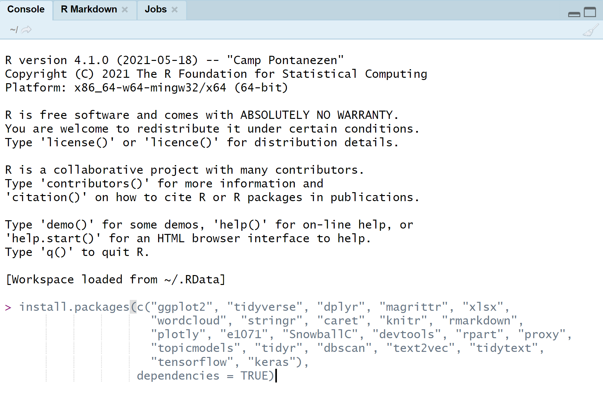

# Intro {.sidebar}
This dashboard covers the course materials for the course [S41: Data Science: Introduction to Text Mining with R](https://utrechtsummerschool.nl/courses/social-sciences/data-science-introduction-to-text-mining-with-r).


---

<!-- <center> -->
<!-- {width=100%} -->
<!-- </center> -->

---
ADD COURSE INFO
Instructor: FILL   
Study load: FILL   
Assessment: FILL   


---

\
Course director: [Ayoub Bagheri](https://ayoubbagheri.nl/)

Instructors:

* [Ayoub Bagheri](https://ayoubbagheri.nl/)\
* [José de Kruif](https://www.uu.nl/medewerkers/JdeKruif)\
+ [Dong Nguyen](https://dongnguyen.nl/)\
- [Qixiang Fang](https://www.uu.nl/medewerkers/QFang)\


Study load: 1 ECTS

Location: [Marinus Ruppert building 033](https://www.uu.nl/en/marinus-ruppert-building)

---

# Quick Overview

## Column 1

### Outline

Nowadays, from social sciences to humanities and healthcare, a major portion of data is inside text. However, text is considered as a kind of unstructured information, which is difficult to process automatically. Therefore, text mining can be applied to create a more structured representation of a text, making its content more accessible to researchers. Therefore, this course offers an elaborate introduction into text mining with R. The course has a strongly practical hands-on focus, and students will gain experience in using text mining on real data from for example social sciences and healthcare domains and interpreting the results. Through lectures and practicals, the students will learn the necessary skills to design, implement, and understand their own text mining pipeline. The topics in this course include regular expressions, text preprocessing, text classification and clustering, and word embedding approaches for text data.

The course deals with the following topics:

* Understand and explain the fundamental approaches to text mining;
* Understand and apply current methods for analyzing texts;
* Understand how text is handled, manipulated, preprocessed and cleaned;
* Define a text mining pipeline given a practical data science problem;
* Implement generic text mining tools such as regular expression, text clustering, text classification, sentiment analysis, and word embedding.

The course starts at a very basic level and builds up gradually. At the end of the course, participants will master text mining skills with R. 

### Requirements
Participants should have a basic knowledge of scripting in R.

### Prerequisites
Participants are requested to bring their own laptop for the lab meetings.

### Certificate
Participants will receive a certificate at the end of the course.

### Additional references
1- Jurafsky, D., Martin, J.H. (2020). Speech and language processing, third edition. Find online chapters [here](https://web.stanford.edu/~jurafsky/slp3/)


2- Eisenstein, J. (2018). Natural Language Processing. Find online chapters [here](https://github.com/jacobeisenstein/gt-nlp-class/blob/master/notes/eisenstein-nlp-notes.pdf)


3- Silge, J., & Robinson, D. (2017). Text mining with R: A tidy approach. O'Reilly Media, Inc.". Find the book [here](https://www.tidytextmining.com/)


## Column 2

### Daily schedule

| Start time | End time | Type      |
|:-----------|:---------|:----------|
|  09:00     | 10:30    | Lecture   |
|            |**Break** |           |
|  10:45     | 11:45    | Practical |
|  11:45     | 12:30    | Discussion|
|            |**[Lunch](https://www.uu.nl/en/educatorium)** |           |
|  13:45     | 15:15    | Lecture   |
|            |**Break** |           |
|  15:30     | 16:30    | Practical |
|  16:30     | 17:00    | Discussion|


# How to Prepare

## Column 1

### Preparing yourself and your machine for the course

If you have no experience with `R` or another programming language, you are going to need to catch up before starting the course and during the course.

Some good sources are:

  - The first two chapters of [introduction to R on datacamp](https://www.datacamp.com/courses/free-introduction-to-r)
  - Install `R`, play around, and [read the workflow basics chapter in Hadley Wickham's R for Data Science](http://r4ds.had.co.nz/workflow-basics.html#workflow-basics)
  - Interactive R course: install `R` as in the previous point and in the console type the following lines one by one
```r
install.packages("swirl")
library(swirl)
swirl()
```
and follow the guide to run the `R Programming: The basics of programming in R` interactive course.

### System requirements

Bring a laptop computer to the course and make sure that you have full write access and administrator rights to the machine. We will explore programming and compiling in this course. This means that you need full access to your machine. Some corporate laptops come with limited access for their users, we therefore advice you to bring a personal laptop computer, if you have one. 

### **1. Install `R`**
`R` can be obtained [here](https://cran.r-project.org). We won't use `R` directly in the course, but rather call `R` through `RStudio`. Therefore it needs to be installed. 

### **2. Install `RStudio` Desktop**

Rstudio is an Integrated Development Environment (IDE). It can be obtained as stand-alone software [here](https://www.rstudio.com/products/rstudio/download/#download). The free and open source `RStudio Desktop` version is sufficient.

### **3. Start RStudio and install the following packages. **

Execute the following lines of code in the console window:

```{r eval=FALSE, echo = TRUE}
install.packages(c("ggplot2", "tidyverse", "dplyr", "magrittr", "micemd", "jomo", "pan", 
                 "lme4", "knitr", "rmarkdown", "plotly", "ggplot2", "shiny", 
                 "devtools", "boot", "class", "car", "MASS", "ggplot2movies", 
                 "ISLR", "DAAG", "mice"), 
                 dependencies = TRUE)
```


If you are not sure where to execute code, use the following figure to identify the console:

<center>
  
</center>

Just copy and paste the installation command and press the return key. When asked 

```{r eval = FALSE, echo = TRUE}
Do you want to install from sources the package which needs 
compilation? (Yes/no/cancel)
```

type `Yes` in the console and press the return key.

### Required `R` knowledge

The following is the minimum of what you should know about `R` before starting with the first practical

- What is `R` (a fancy calculator) and what is an `.R` file (a recipe for calculations)
- What is an `R` package (a set of functions you can download to use in your own code)
- How to run `R` code in `RStudio`
- What is a variable `x <- 10`
- What is a function `y <- fun(x = 10)`
- Understand what the following statements do (tip: you may run it in `R` line by line)

```r
y <- "Let him go!"
x <- "Bismillah!"
z <- paste(x, "No, we will not let you go.", y)
rep(z, 3)
1:10
sample(1:20, 4)
sample(1:20, 40, replace = TRUE)
z <- c(1, 2, 3, 4, 5, 4, 3, 2, 1)
z^2
z == 2
z > 2
install.packages("dplyr")
library(dplyr)
```

- Be able to read the help file of any function, (e.g., type `?plot` in the console)

## Column 2

### What if the steps to the left do not work for me?

If all fails and you have insufficient rights to your machine, the following web-based service will offer a solution. 

- Open a free account on [rstudio.cloud](https://rstudio.cloud). You can run your own cloud-based `RStudio` environment there. Naturally, you will need internet access for these services to be accessed.

# Monday
## Column 1

### Materials

We adapt the course as we go. To ensure that you work with the latest iteration of the course materials, we advice all course participants to access the materials online. All lectures are in html format. Impractical files contain the exercises, without walkthrough, explanations and solutions. Practicals are walkthrough files that guide you through the exercises.

Here you will find the materials for Monday:

- Part 1: Introduction
    - [Lecture 1](Monday/Lectures/Lecture 1/Lecture_1.html)
    - [Impractical 1](Monday/Practicals/Practical 1/Impractical_1.html)
    - [Practical 1](Monday/Practicals/Practical 1/Practical_1.html)
    - [Data for practical 1](Monday/Practicals/Practical 1/data.zip)

- Part 2: Text preprocessing
    - [Lecture 2]()
    - [Impractical 2]()
    - [Practical 2]() 

## Column 2

### Additional references

Chapter 2 of ref 1, chapter 3 of ref 2

# Tuesday
## Column 1

### Materials

We adapt the course as we go. To ensure that you work with the latest iteration of the course materials, we advice all course participants to access the materials online. All lectures are in html format. Impractical files contain the exercises, without walkthrough, explanations and solutions. Practicals are walkthrough files that guide you through the exercises.

Here you will find the materials for Tuesday:

- Part 3: Text classification
    - [Lecture 3](Tuesday/Lectures/Lecture 3/Lecture_3.html)
    - [Impractical 3](Tuesday/Practicals/Practical 3/Impractical_3.html)
    - [Practical 3](Tuesday/Practicals/Practical 3/Practical_3.html) 

- Part 4: Sentiment analysis
    - [Lecture 4](Tuesday/Lectures/Lecture 4/Lecture_4.html)
    - [Impractical 4](Tuesday/Practicals/Practical 4/Impractical_4.html)
    - [Practical 4](Tuesday/Practicals/Practical 4/Practical_4.html) 


## Column 2

### Additional references

Chapter 2 of ref 1, chapter 3 of ref 2

# Wednesday
## Column 1

### Materials

We adapt the course as we go. To ensure that you work with the latest iteration of the course materials, we advice all course participants to access the materials online. All lectures are in html format. Impractical files contain the exercises, without walkthrough, explanations and solutions. Practicals are walkthrough files that guide you through the exercises.

Here you will find the materials for Wednesday:

- Part 5: Text clustering
    - [Lecture 5](Wednesday/Lectures/Lecture 5/Lecture_5.html)
    - [Impractical 5](Wednesday/Practicals/Practical 5/Impractical_5.html)
    - [Practical 5](Wednesday/Practicals/Practical 5/Practical_5.html) 

- Part 6: Word embedding
    - [Lecture 6]()
    - [Impractical 6](Wednesday/Practicals/Practical 6/Impractical_6.html)
    - [Practical 6](Wednesday/Practicals/Practical 6/Practical_6.html) 


## Column 2

### Additional references

Chapter 2 of ref 1, chapter 3 of ref 2

# Archive
Soon all the materials of the course will be availabe here in a compact file for download.
